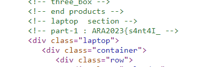
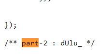
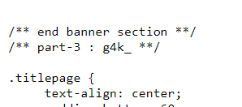
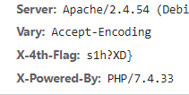

# DewaWeb
> Dewaweb sedang mencari talenta terhebat!

> Kamu adalah seorang inspektur terkenal yang telah dikenal mampu untuk memecahkan seluruh teka-teki. Tidak ada sesuatu yang luput dari penglihatanmu, bahkan untuk sesuatu yang tidak terlihat oleh mata orang biasa. Dewaweb mencari orang sepertimu.

> Saat ini Dewaweb ingin menguji keahlian analisamu. Coba temukan apa yang Dewaweb sembunyikan di website ini. Buktikan bahwa kamu adalah seseorang yang pantas untuk Dewaweb!

## About the Challenge
Given a static web link about Dewaweb.

## How to Solve?
To solve this chall it is required to find the parts of each flag (There are 4 parts of the flag). The first part is in the `index.html` file



The second part can be found in the JavaScript file (`/js/custom.js`)



The third part can be found in the CSS file ()`/css/style.css`)



Then the last part can be found in the website `Cookie` response header



```
ARA2023{s4nt4I_ dUlu_ g4k_ s1h?XD}
```