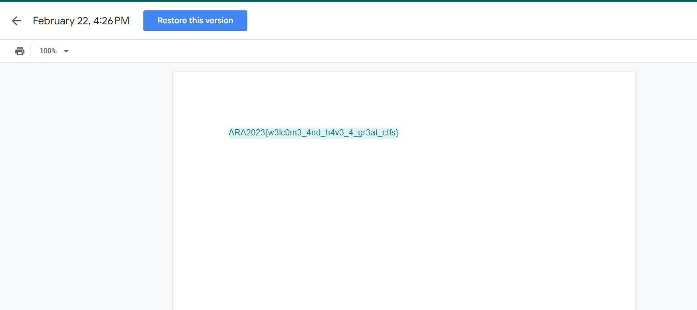

# In-sanity check
> Even the flag for sanity check is gone?

## About the Challenge
We are given a link which if pressed then the user will be redirected to a google docs

## How to Solve?
To solve this, you can look at the Google Docs editing history to get the flag



```
ARA2023{w3lc0m3_4nd_h4v3_4_gr3at_ctfs}
```