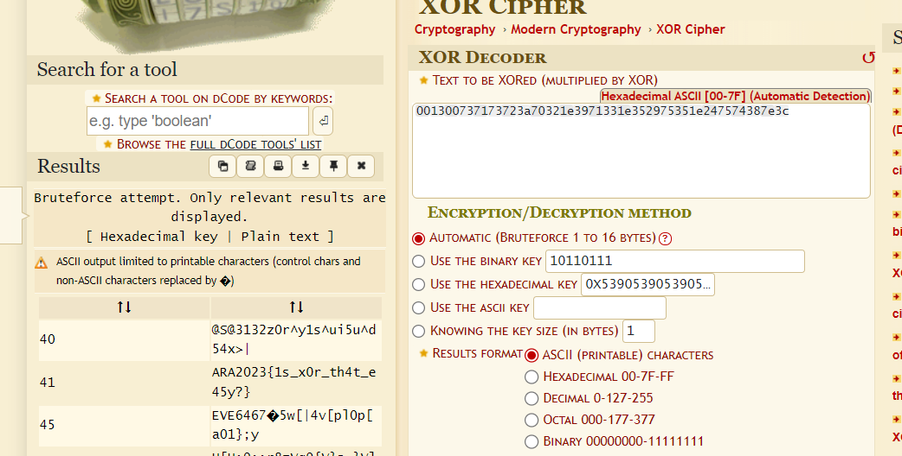

# L0v32x0r
> Vonny and Zee were having a treasure hunt game until they realized that one of the clues was a not alike the other clues as it has a random text written on the clue.

> The clue was "001300737173723a70321e3971331e352975351e247574387e3c".

> Help them to find what the hidden clue means!

## About the Challenge
Given a string containing a combination of numbers and letters

## How to Solve?
To solve this problem use XOR Decoder and then we will get the flag



```
ARA2023{1s_x0r_th4t_e45y?}
```