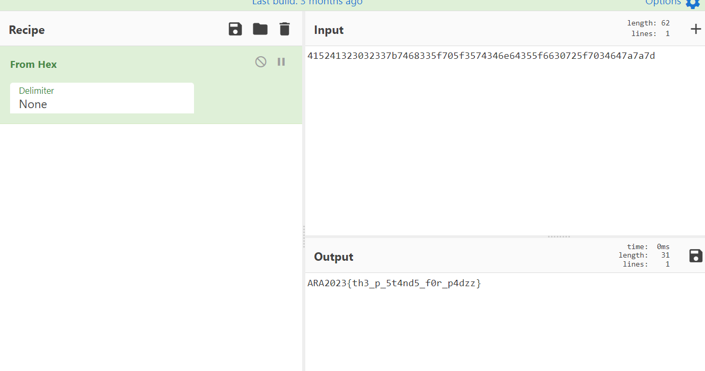

# One Time Password
> bwoah, some innovative challenges

## About the Challenge
Given a file called `one_time_password.txt` and when we open the file, the contents are like this
```
A: 161a1812647a765b37207a1c3b1a7b54773c2b660c46643a1a50662b3b3e42
B: 151d616075737f322e2d130b381666547d3d4470054660287f33663d2a2e32

XOR: 415241323032337b7468335f705f3574346e64355f6630725f7034647a7a7d
```

## How to Solve?
To solve this problem all that is needed is to change the XOR result from Hex to ASCII



```
ARA2023{th3_p_5t4nd5_f0r_p4dzz}
```