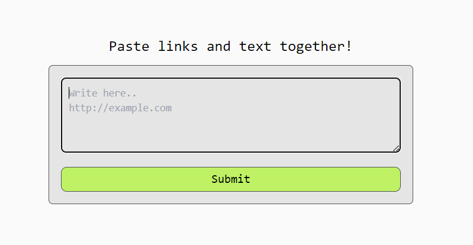
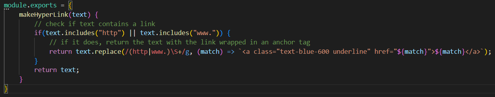
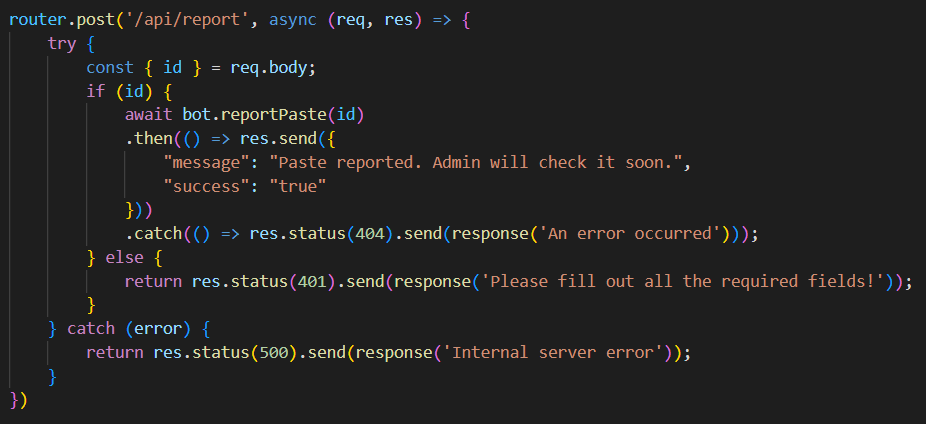
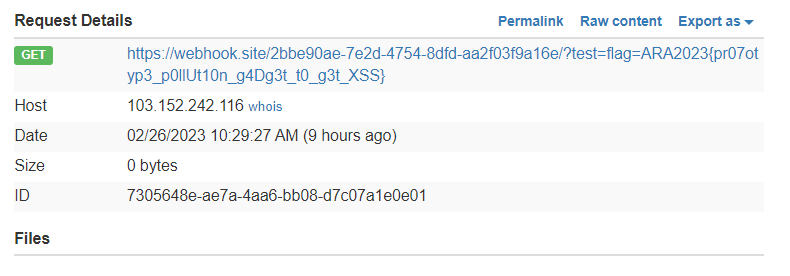

# Paste It
> I made my own "Pastebin", its called "Paste It". It's 100% Free and 101% Secure. What you waiting for? share your paste to your friend right now!.

## About the Challenge
Provided the website along with the source code (You can get the source code [here](web_pasteit.zip)). The website has a function to enter a link that will be shared, and later our input results can be shared with other people



## How to Solve?
After checking the source code there is `DOMPurify` which makes us unable to enter the XSS payload directly into the form. This can be bypassed by referring to this [website](https://portswigger.net/research/bypassing-dompurify-again-with-mutation-xss)

Then there is also a filter if the input contains the string `http` or `www.` Then it will be replaced with `a` tag. but this can still be bypassed by separating between `http` or using a double slash `//`



So the final payload is:
```
<math><mtext><table><mglyph><style><!--</style></mglyph>;">
```

And then after XSS payload works successfully, then give an `id` to the admin by requesting the endpoint `/api/report` with the body `id`



Check the webhook and there will be a flag on `Request Details`



```
ARA2023{pr07otyp3_p0llUt10n_g4Dg3t_t0_g3t_XSS}
```