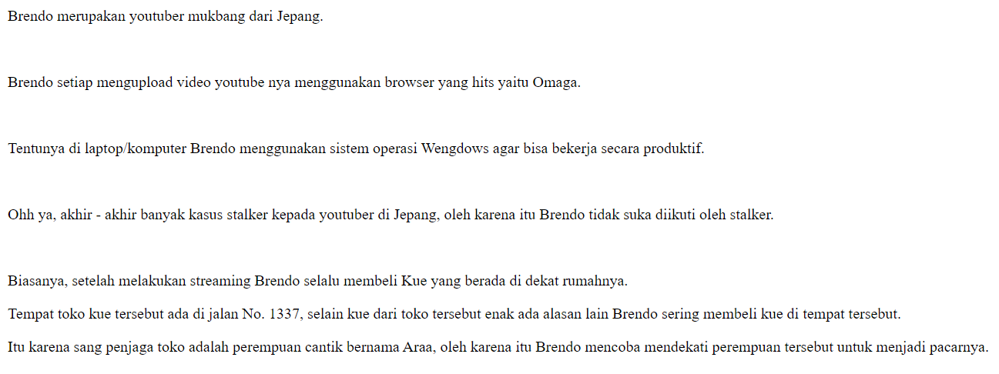
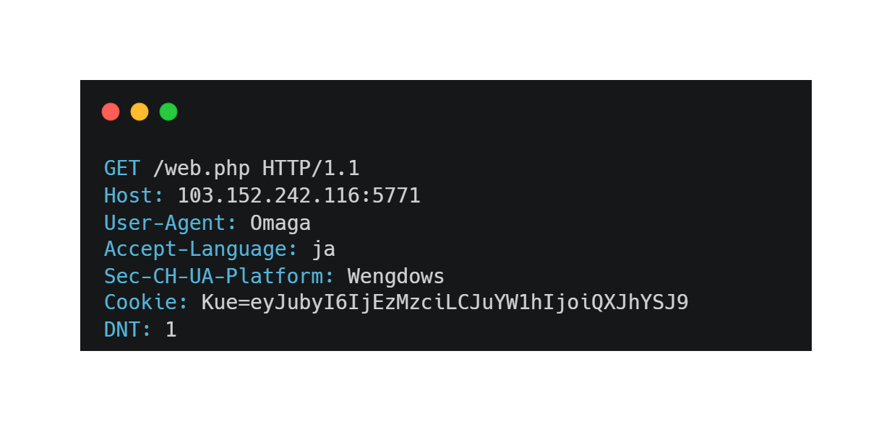
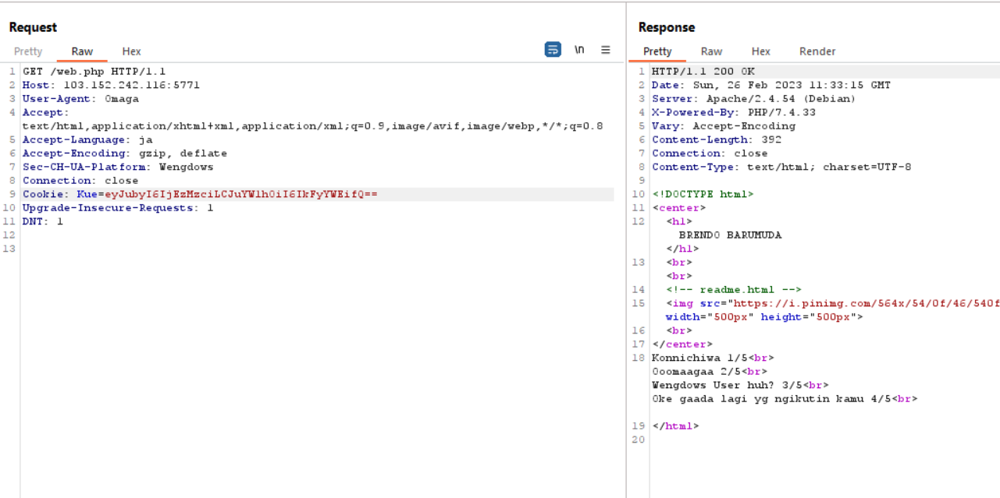

# X-Is for blabla
> Recently my friend was buy helmet called RFC 2616, pretty strange huh?

## About the Challenge
Given a plain website (There are only pictures and text), but when you look at the HTML code there is a new file called `readme.html` which contains something like a story



## How to Solve?
To solve this chall, we must adjust the conditions of `readme.html.` So there are 5 conditions that must be met to get the flag:

* Language must be set to `ja` (Japan)
* Browser must be set to `Omaga`
* Set operation system to `Wengdows`
* Tracker settings
* Then there is a `Cake` that must be set (There are 2 conditions namely the `Number 1337` and the name of the girl is `Araa`)

The HTTP request will be looks like this



And in the response a flag will appear



```
ARA2023{H3ad_1s_ImP0rt4Nt}
```