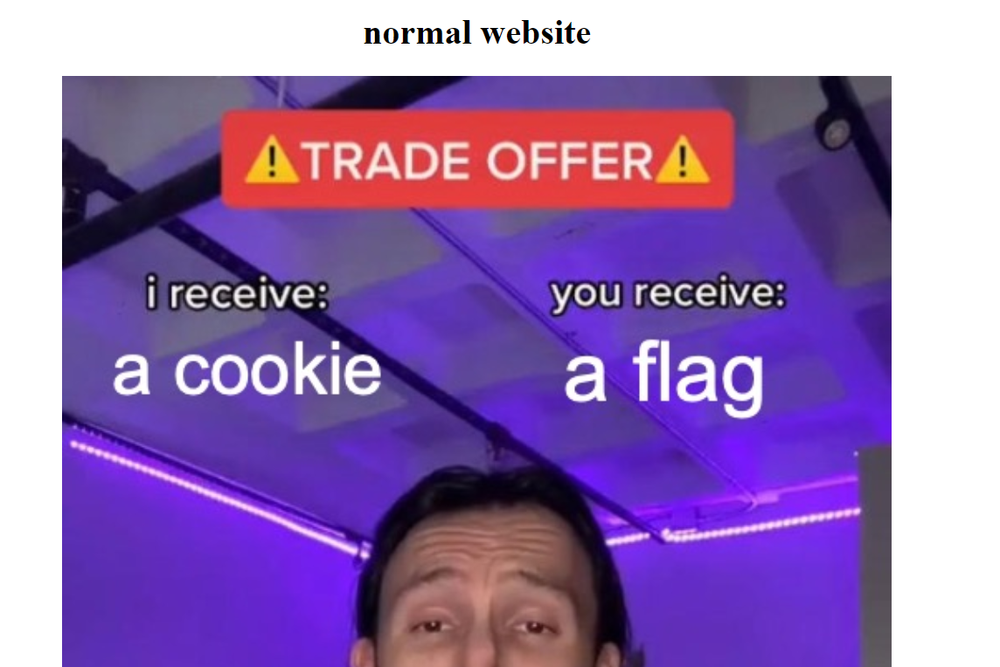
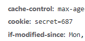
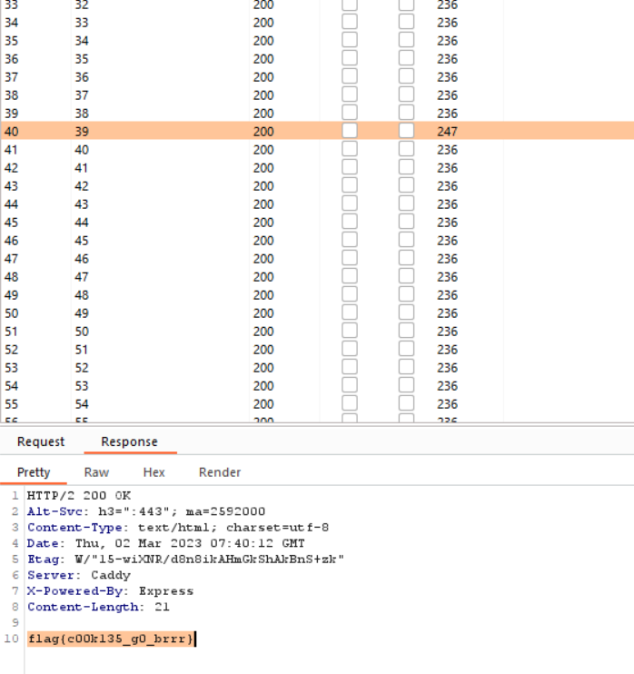

# Cookie
> I have a trade offer for you. The challenge is at https://cookies.acmcyber.com

## About the Challenge
We need to find the flag on the website We were given. The website is just a plain website and there is a button to get the cookie




## How to Solve?
I tried to click the `get cookie!` button and then there is a new cookie on HTTP request



And then in the one of the image said that I need to go to `/flag` endpoint to get the flag. But when I open that there is just a simple message

```
icky cookie
```

I stuck a little bit and decided to try changing the cookie value from 1 - 75 and luckily I got the flag



```
flag{c00k135_g0_brrr}
```