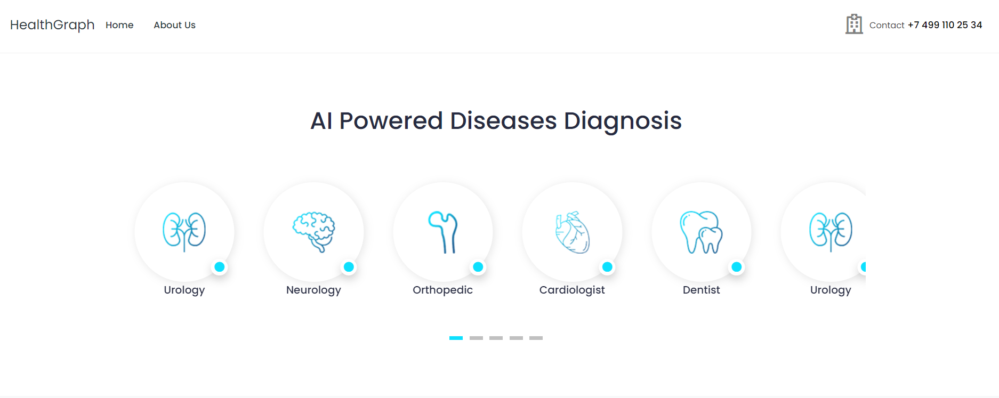
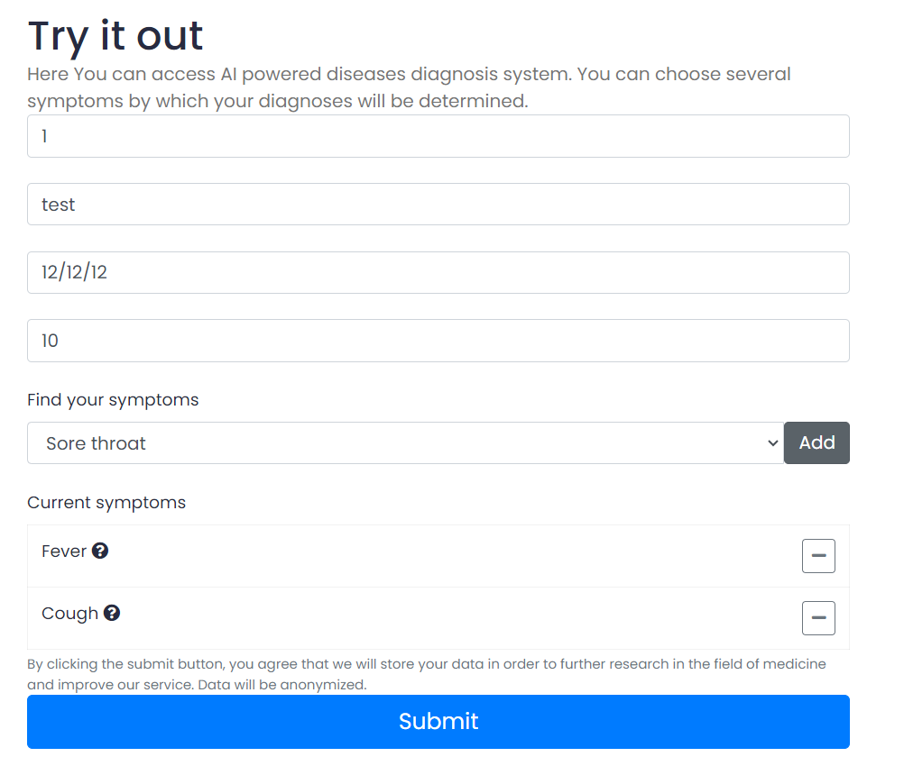
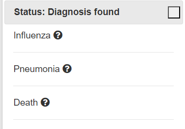
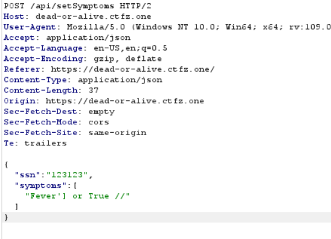
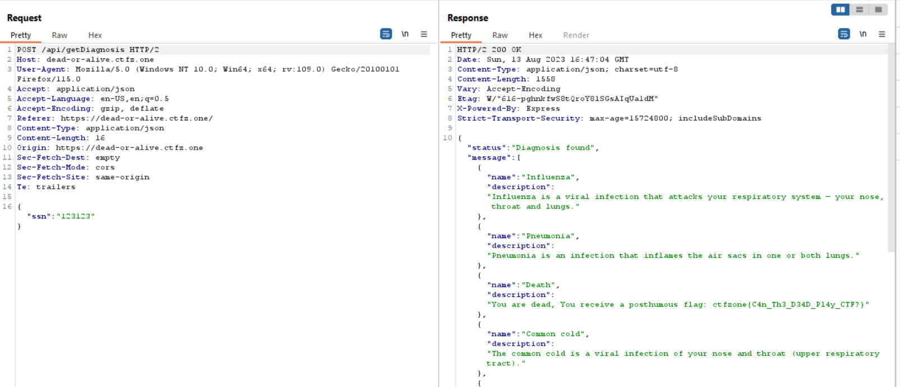

# Dead or Alive
> We have developed an innovative disease detection system using graph theory. Come and test our system, all your personal data is securely protected

## About the Challenge
We were given a source code (You can download the source code [here](source.zip)) and a website, here is the preview of the website



In this website, there is a form where we can input the SSN (Social Security Number), full name, birth date, weight, and the symptoms.



The website will generate the possible diseases we may suffer from based on the symptoms



## How to Solve?
Let's check the source code first, there is a file called `app.js`

```js
import express from 'express';
import nunjucks from 'nunjucks';
import neo4j from 'neo4j-driver';
import md5 from 'md5'
import moment from 'moment'
```

It looks like this website using `node` as a backend, `nunjucks` as a templating engine, and `neo4j` as a database. There are 3 endpoints that we can use:

* /api/setUser
* /api/setSymptoms
* /api/getDiagnosis

When the user called `/api/setUser` endpoint, the code will call `setUser` function. Here is the content of `setUser` function

```js
async function setUser(ssn, name, yearOfBirth, weight){
    const session = driver.session();
    const q = `
        MERGE (p:Patient {
                    ssn: '${ssn}'
                })
        ON CREATE SET p.since = date()
        SET p.name = '${name}'
        SET p.yearOfBirth = ${yearOfBirth}
        SET p.weight = ${weight}
    `
    return session.run(q)
            .catch(() => {})
            .then(() => session.close());
}
```

When the user called `/api/setSymptoms` endpoint, the code will call `setSymptoms` function. Here is the content of `setSymptoms` function

```js
async function setSymptoms(ssn, symptoms){
    const session = driver.session();
    let q = `
        MATCH (p:Patient {ssn: '${ssn}'})
        MATCH (s:Symptom) WHERE s.name in [${symptoms}]
        MERGE (p)-[r:HAS]->(s)
    `;
    return session.run(q)
            .catch(() => {})
            .then(() => session.close());
}
```

When the user called `/api/getDiagnosis` endpoint, the code will call `getDiagnosis` function. Here is the content of `getDiagnosis` function

```js
async function getDiagnosis(ssn){
    const session = driver.session();
    const q = `
        // get patient symptoms as array
        MATCH (p:Patient {ssn: '${ssn}'})-[:HAS]->(s:Symptom)-[:OF]->(d:Disease)
        WITH d, collect(s.name) AS p_symptoms
        
        // looking for a match of the patient's symptoms in the symptoms of diseases
        MATCH (d)<-[:OF]-(d_symptom:Symptom)
        WITH d, p_symptoms, collect(d_symptom.name) as d_symptoms
        WHERE size(p_symptoms) = size(d_symptoms)
        RETURN d.name, d.description
    `;
    const result = await session.run(q).catch(() => {});
    session.close();
    return result?.records.map((record) => ({
            name: record.get('d.name'),
            description: record.get('d.description')
    }));
}
```

It looks like there is no filter in the user input. So, these 3 endpoints is vulnerable to Cypher Injection. But if we check the routes again, There is a filter that limits our input:

* /api/setUser
  * SSN: There is a limit of characters (9 characters)
  * Full name: The program hashed our input
  * Year of Birth: Date format (DD-MM-YYYY)
  * Weight: Only accept float as a user input
* /api/setSymptoms
  * SSN: There is a limit of characters (9 characters)
  * Symptom: No filter
* /api/getDiagnosis
  * SSN: There is a limit of characters (9 characters)

So we can only exploit the website in the `symptom` parameter. For this chall, the flag was located in the disease table. To obtain the flag, we need to input `Fever'] or True //` in the `symptom` parameter. The neo4j query will run like this

```
MATCH (p:Patient {ssn: '000000001'})
MATCH (s:Symptom) WHERE s.name in ['Fever'] or True //']
MERGE (p)-[r:HAS]->(s)
```



And then hit `/api/getDiagnosis` to obtain the flag



You can see the flag in the description of the disease

```
ctfzone{C4n_Th3_D34D_Pl4y_CTF?}
```