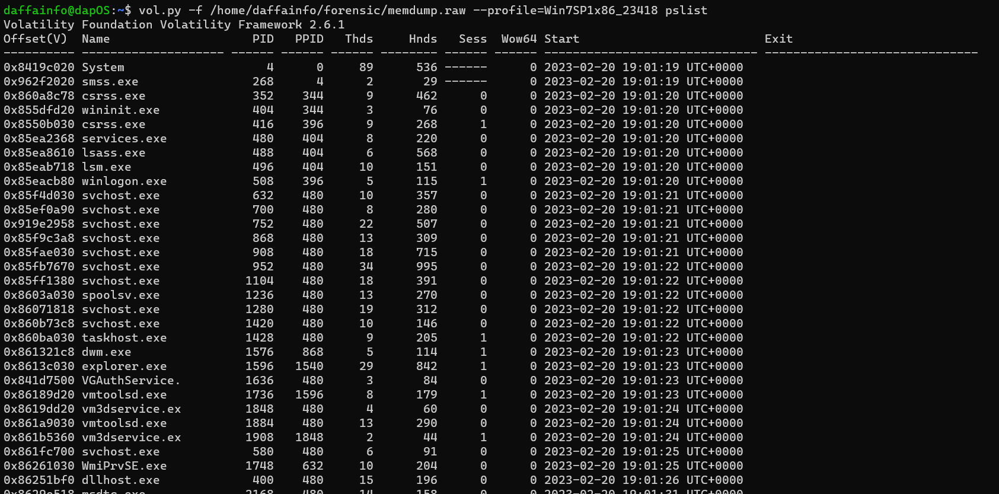
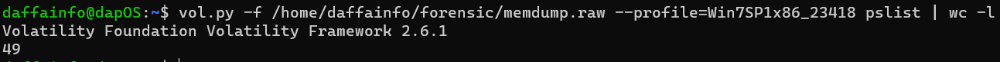

# Attaaaaack2
> Q2. How many processes were running ? (number)

> ( doesnt follow format)

## About the Challenge
We got `raw` image and we need to determine the total number of processes that were running

## How to Solve?
To solve this, we need to find the list of process using `pslist` plugin. Here is the command I used

```
vol.py -f /path/to/memdump.raw --profile=Win7SP1x86_23418 pslist
```



And to find the total of the proccess, we need to use `wc -l` command and the result must be substracted by 2 because we don't need to count the header



```
47
```