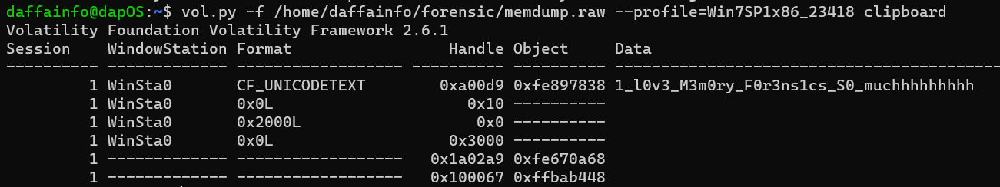
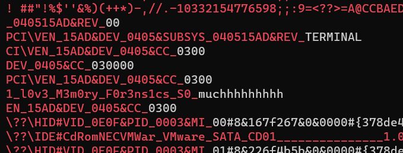

# Attaaaaack3
> Q3. i think the user left note on the machine. can you find it ?

> flag format : crew{}

## About the Challenge
We got `raw` image and we need to find the note

## How to Solve?
To solve this, we need to find the note using `clipboard` plugin. Here is the command I used

```
vol.py -f /path/to/memdump.raw --profile=Win7SP1x86_23418 clipboard
```



Or if you check the the list of the process using `pslist`, you will see there is a notepad process (PID: 2556). Dump it using `memdump` plugin and then set the pid to 300. Here is the command I used to dump the notepad memory

```
vol.py -f /home/daffainfo/forensic/memdump.raw --profile=Win7SP1x86_23418 memdump -p 300 --dump-dir .
```

And then because the format of the flag usually like this `this_is_random_text`. So I tried to grep the string that have a lot of underscore character, here is the command I used to grep the flag

```
strings -e l 2556.dmp | grep -E "(.*?)_(.*?)_"
```



```
crew{1_l0v3_M3m0ry_F0r3ns1cs_S0_muchhhhhhhhh}
```