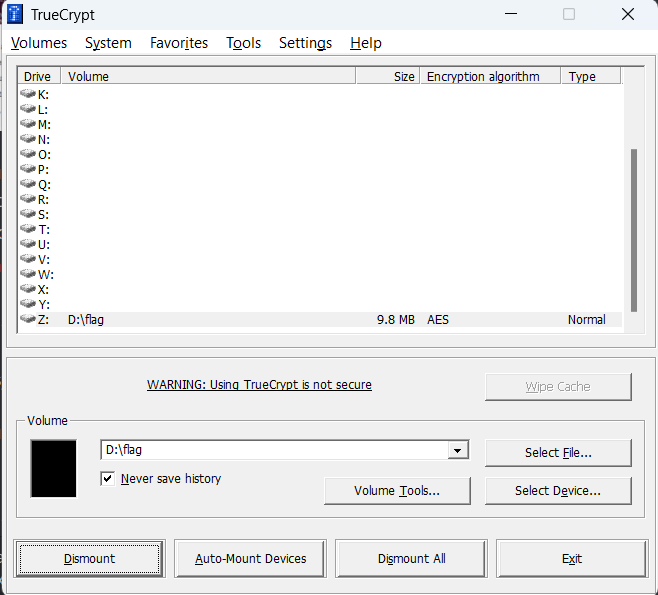
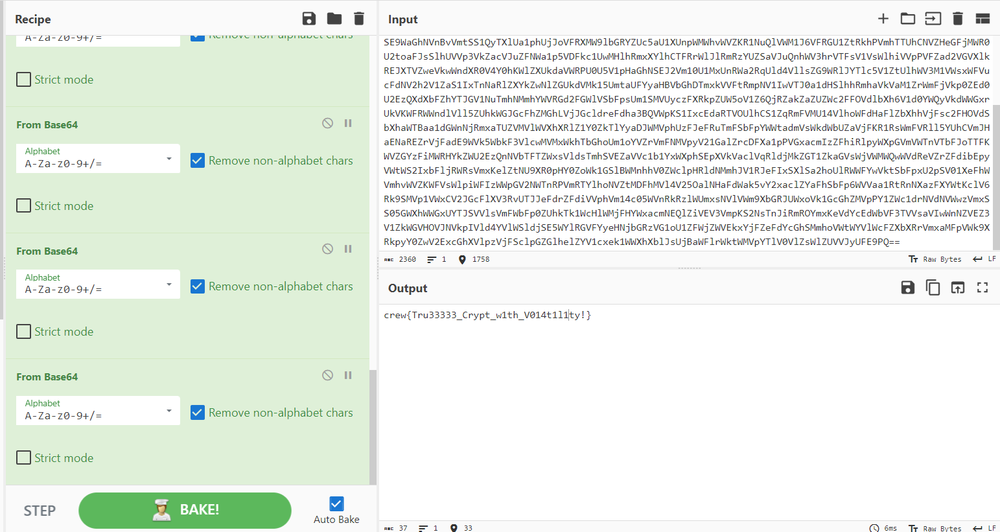

# Encrypt10n (2)
> We made a memory dump on the criminal machine after entering the crime scene. Our investigator thought he was using encryption software to hide the secret. can you help me to detect it?

> Q2 : crew{password}

## About the Challenge
We got a encrypted flag file and we need to decrypt it using `TrueCrypt` software

## How to Solve?
To solve this, we need to install `TrueCrypt` first, and then upload the flag there and you need to input the `TrueCrypt` password



In this case i mounted the flag into `Z:` drive. Now open the drive, and you will see there is a file called `flaaaaaaaaaaaaaaaaaaaaaaaag.txt`. Open the file and decode it using `base64` 14 times



```
crew{Tru33333_Crypt_w1th_V014t1l1ty!}
```