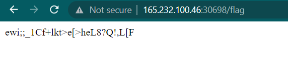
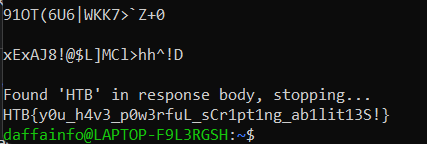

# Persistence
> Thousands of years ago, sending a GET request to /flag would grant immense power and wisdom. Now it's broken and usually returns random data, but keep trying, and you might get lucky... Legends say it works once every 1000 tries.

## About the Challenge
We were given a website, and we need to access `/flag` continously to get the flag



## How to Solve?
To solve this I have created a python script to continuously hitting the `/flag` endpoint and the script will stop if the flag has been found

```python
import requests

url = "http://165.232.100.46:30698/flag"

while True:
    response = requests.get(url)
    if "HTB" in response.text:
        print("Found 'HTB' in response body, stopping...")
        print(response.text)
        break
    print(response.text)

```



```
HTB{y0u_h4v3_p0w3rfuL_sCr1pt1ng_ab1lit13S!}
```