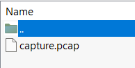

# Plaintext Tleasure
> Threat intelligence has found that the aliens operate through a command and control server hosted on their infrastructure. Pandora managed to penetrate their defenses and have access to their internal network. Because their server uses HTTP, Pandora captured the network traffic to steal the server's administrator credentials. Open the provided file using Wireshark, and locate the username and password of the admin.

## About the Challenge
We were given a zip file (You can download the file [here](forensics_plaintext_treasure.zip)). If we unzip the file, there is a file called `capture.pcap`



## How to Solve?
Open `capture.pcap` using Wireshark and enter `frame containing "HTB"` in the filter section to find packets containing the words `HTB`


Right click the packet and then choose `Follow TCP Stream` to get the flag


```
HTB{th3s3_4l13ns_st1ll_us3_HTTP}
```