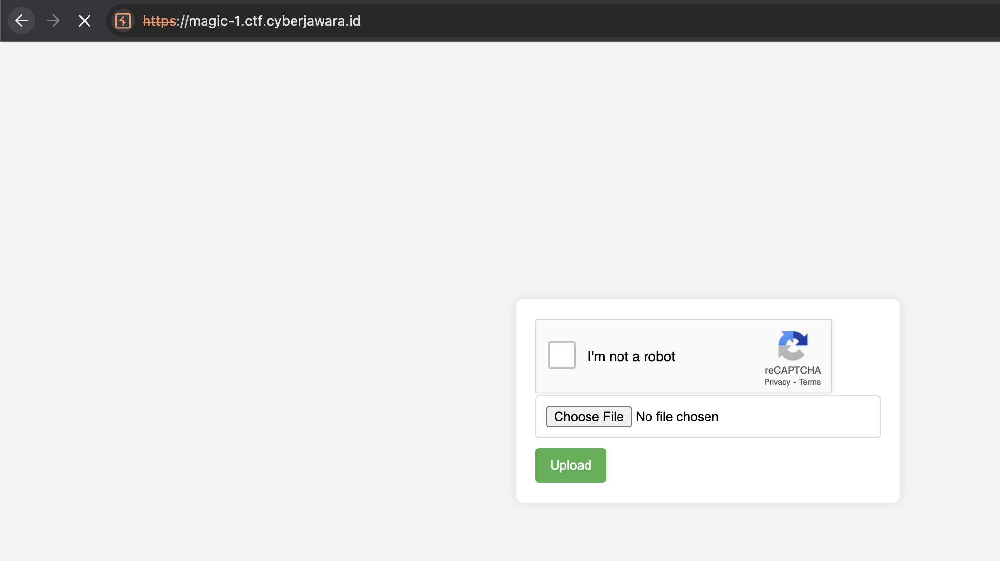

# Magic 1
> Another warmup with PHP web app.

## About the Challenge
We were given a source code (You can download the source code [here](magic-1.zip)) and website, here is the preview of the source code



The website only has 1 functionality where we can upload a file and the file can be accessed in `results` endpoint

## How to Solve?
Even though we can upload some file, there are some restriction here

```php
function canUploadImage($file) {
    $fileExtension = strtolower(pathinfo($file['name'], PATHINFO_EXTENSION));
    $finfo = new finfo(FILEINFO_MIME_TYPE);
    $fileMimeType = $finfo->file($file['tmp_name']);
    $maxFileSize = 500 * 1024;
    return (strpos($fileMimeType, 'image/') === 0 &&
        $file['size'] <= $maxFileSize &&
        strlen($file['name']) >= 30
    );
}
...
...
if ($_SERVER['REQUEST_METHOD'] === 'POST' && isset($_FILES['image'])) {
    if (canUploadImage($_FILES['image'])) {
        move_uploaded_file($_FILES['image']['tmp_name'], 'results/original-' . $_FILES['image']['name']);
        $resizedImagePath = resizeImage($_FILES['image']);
    } else {
        $error = 'Please upload different file.';
    }
}
```

We need to upload an image where the file size is equal or less than 500 * 1024, and the file name is equal or greater than 30 characters. We need to insert the PHP payload into the image, for example `<?php system("cat /flag.txt"); ?>`.


```
CJ2023{4n0th3r_unrestricted_file_upload__}
```