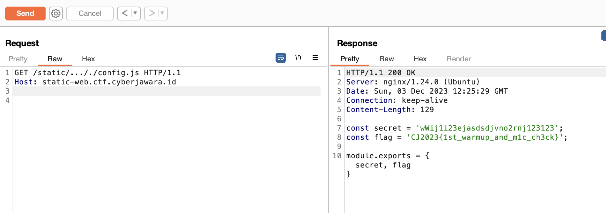

# Static Web
> "Static" web for your hacking warmup.

## About the Challenge
We only got 1 file called `index.js` and here is the content of the file

```javascript
const http = require('http');
const fs = require('fs');
const path = require('path');
const url = require('url');

const config = require('./config.js')

const server = http.createServer((req, res) => {
    if (req.url.startsWith('/static/')) {
        const urlPath = req.url.replace(/\.\.\//g, '')
        const filePath = path.join(__dirname, urlPath);
        fs.readFile(filePath, (err, data) => {
            if (err) {
                res.writeHead(404);
                res.end("Error: File not found");
            } else {
                res.writeHead(200);
                res.end(data);
            }
        });
    } else if (req.url.startsWith('/admin/')) {
        const parsedUrl = url.parse(req.url, true); 
        const queryObject = parsedUrl.query;
        if (queryObject.secret == config.secret) {
            res.writeHead(200);
            res.end(config.flag);
        } else {
            res.writeHead(403);
            res.end('Nope');
        }
    } else if (req.url == '/') {
        fs.readFile('index.html', (err, data) => {
            if (err) {
                res.writeHead(500);
                res.end("Error");
            } else {
                res.writeHead(200);
                res.end(data);
            }
        });
    } else {
        res.writeHead(404);
        res.end("404: Resource not found");
    }
});

server.listen(3000, () => {
    console.log("Server running at http://localhost:3000/");
});
```

The website was vulnerable to path traversal in `/static` endpoint

## How to Solve?
Because there's a filter where we can't input `../`, we need to input `..././` to bypass the filter and then read `config.js` file to obtain the flag



```
CJ2023{1st_warmup_and_m1c_ch3ck}
```