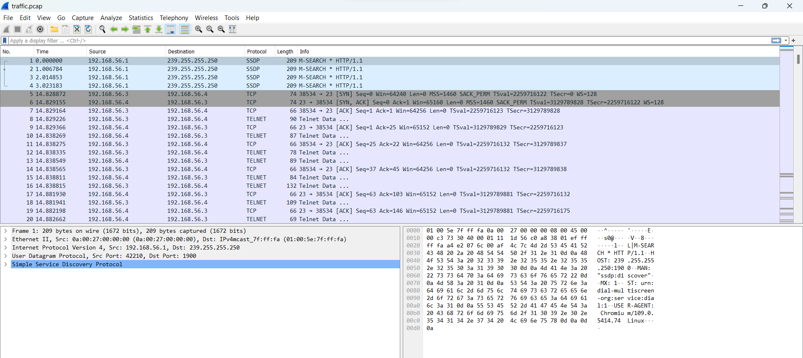
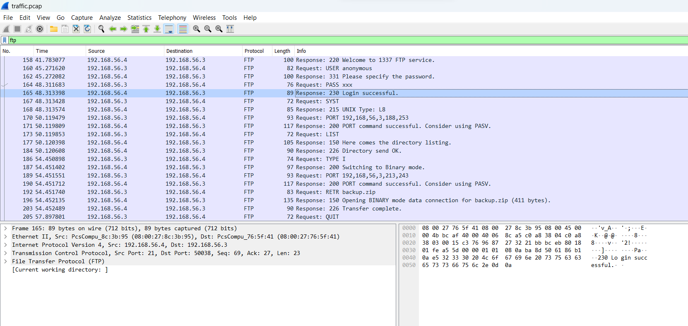
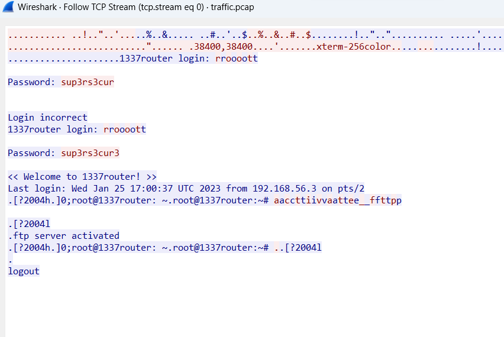
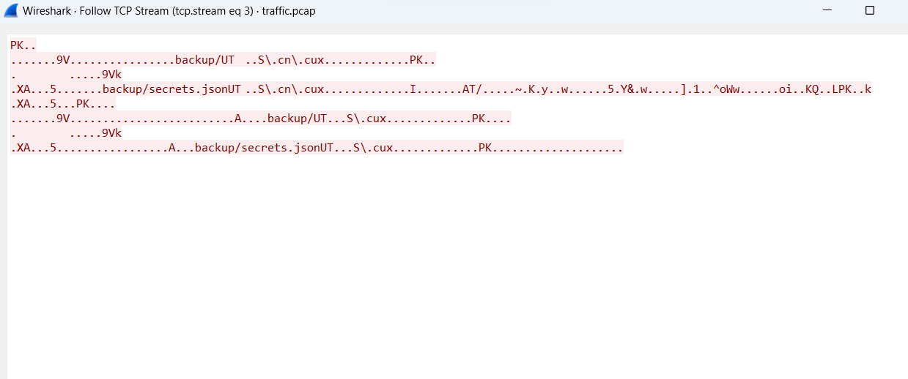
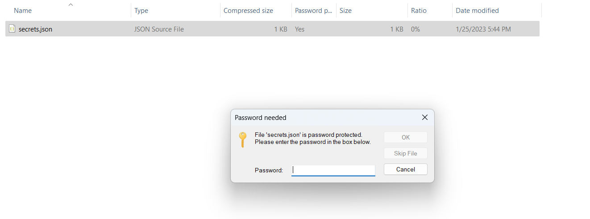

# Backup
> This company has an interesting approach to backuping their routers. I sniffed the network traffic while they conducted a backup. Check if you find something interesting.

## About the Challenge
We got a gzip file (You can download the file [here](backup.tar.gz)) and that file contain a PCAP file called `traffic.pcap`



## How to Solve?
If you analyze the traffic, you will see there are a lot of FTP traffic here, you can filter it using `ftp`



Choose one of the packet, right click and then choose `Follow TCP stream`. In stream `0` there is a user password



And in stream `3` there is a zip file that we can extract



Extract the zip file first and you will find a file called `secrets.json`. To open the file we need to know the key.



Use the password that you have found in stream `0` (The password is `sup3rs3cur3`)


```
flag{TelnetAndFTPAreSoVErySecure}
```