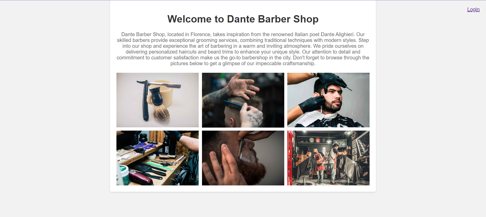
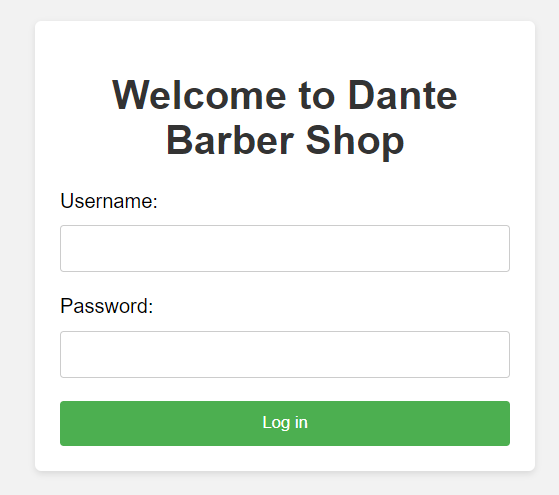
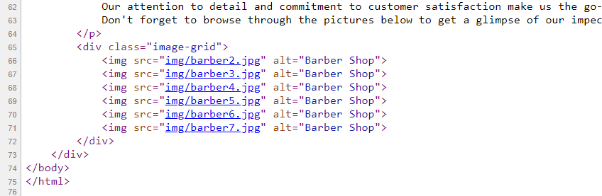
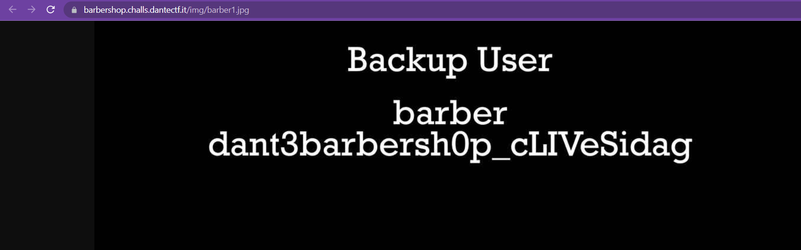
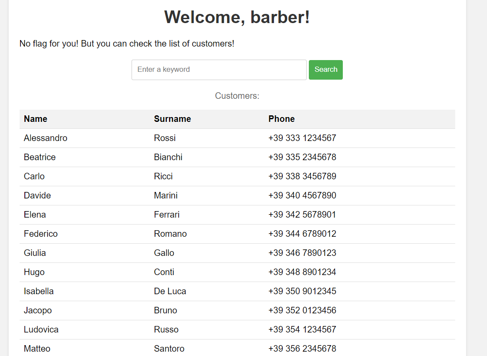
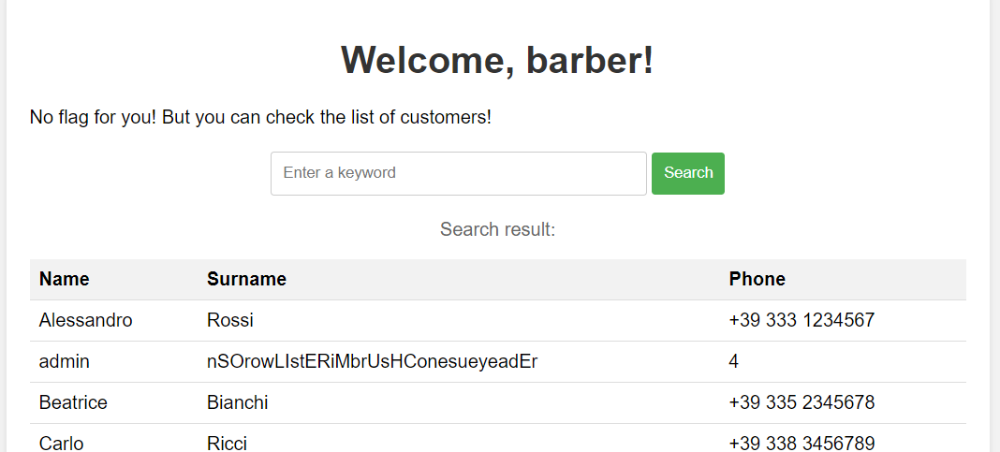
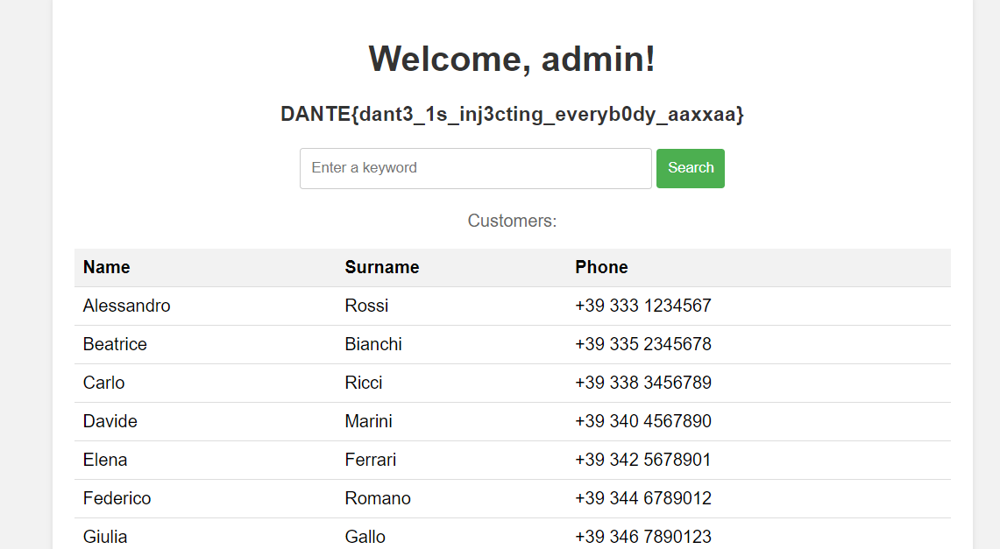

# Dante Barber Shop
> Welcome to our renowned barber shop! Your task, should you choose to accept it, is to uncover hidden information and retrieve the sensitive data that the owners may have left around.

## About the Challenge
We were given a website about barber, there are 6 images in the homepage



And also there is an admin panel functionality



## How to Solve?
At first, I tried to bypass the login by using SQL and NoSQL injection payloads, but the attempt failed. Then, I checked the homepage and noticed something peculiar about the filenames of each image.



Because `barber1.jpg` was missing, I tried to access the image by visiting `https://barbershop.challs.dantectf.it/img/barber1.jpg`, and luckily, we obtained a user credential.



Use that credential to login to the website, and inside the admin panel, there is a search functinality and also a table containing customer list



This functionality was vulnerable to SQLite injection, and in this case I will extract the admin credential using this payload

```
' union select 1,(SELECT username from users),(SELECT password from users),4-- -
```



Use that admin credential to login to admin panel again to obtain the flag



```
DANTE{dant3_1s_inj3cting_everyb0dy_aaxxaa}
```