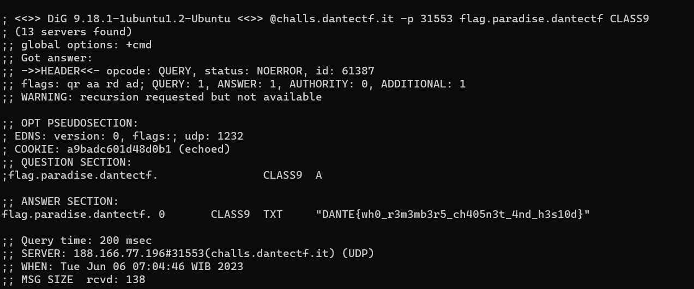

# Demonic Navigation Skills
> A friend told me that they are creating a new celestial network, way better than our Internet even though it is based on some long forgotten tech. Do you have the skills to find the Holy Record? Start your search at gates.hell.dantectf.

## About the Challenge
We were given a server, and we need to check the records of the server, for example `NS`, `A`, etc.

## How to Solve?
Well, this is how I solved the challenge: first, I checked the `gates.hell.dantectf` using the `dig` command. You will see there is a subdomain in the `ANSWER SECTION`, and you need to look up that subdomain and find more information by checking another records. Repeat that step until you obtain the flag.

```
dig @challs.dantectf.it -p 31553 gates.hell.dantectf
dig @challs.dantectf.it -p 31553 tesssss.purgatory.dantectf NS
dig @challs.dantectf.it -p 31553 skies.paradise.dantectf CLASS9
dig @challs.dantectf.it -p 31553 flag.paradise.dantectf CLASS9
```



```
DANTE{wh0_r3m3mb3r5_ch405n3t_4nd_h3s10d}
```