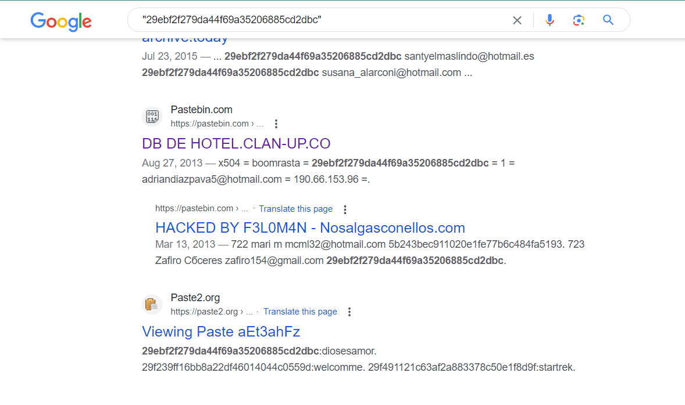
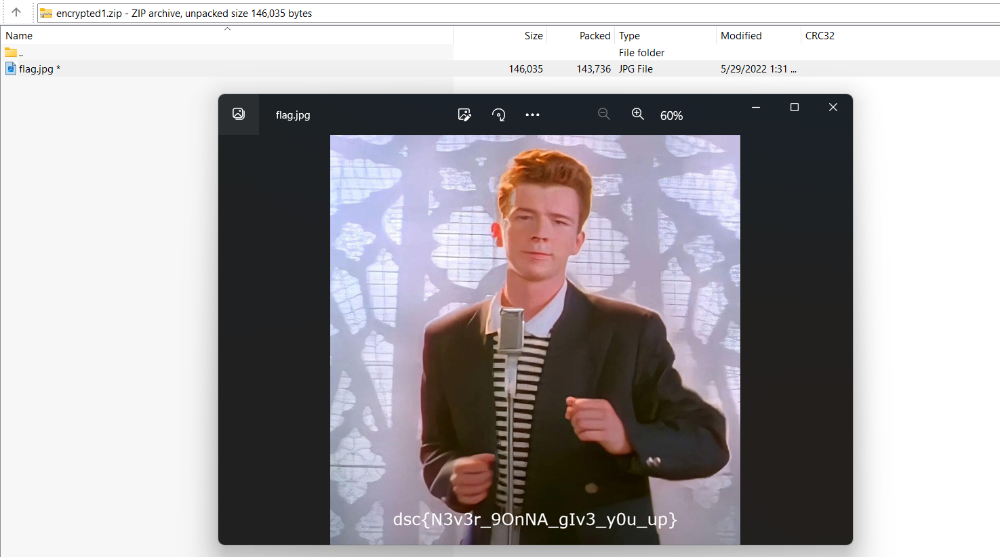

# Hash roll
> Augustine's friend took a important file of augustine and stashed it.

> He was able to grab all the files from his friend's machine but he is worried that the files are encrypted.

> Help him get the file back

## About the Challenge
We got 2 files, `nothing.pdf` and also `encrypted1.zip` (This is a zip protected password) and we need to find the password for `encrypted1.zip` 

## How to Solve?
Open the `nothing.pdf` first, and then tried to use `CTRL + a` keyboard shortcut to select all texts


You will notice there was very small text at the bottom of the PDF file. Now, press `CTRL + c` to copy the text and `CTRL + v` to paste the text into a text editor (in this case, I'm using Notepad). We got some interesting results.

```
Never gonna give you up
Never gonna let you down
Never gonna run around and desert you
Never gonna make you cry
Never gonna say goodbye
Never gonna tell a lie and hurt you
We've known each other for so long
Your heart's been aching, but you're too shy
to say it
29ebf2f279da44f69a35206885cd2dbc might be something you need
```

Afterward, I tried searching the MD5 hash on Google, and we found out that the password for the zip file is `diosesamor`



Extract the zip file, and you will find one file called `flag.jpg`. Open it to obtain the flag.



```
dsc{N3v3r_9OnNA_gIv3_y0u_up}
```