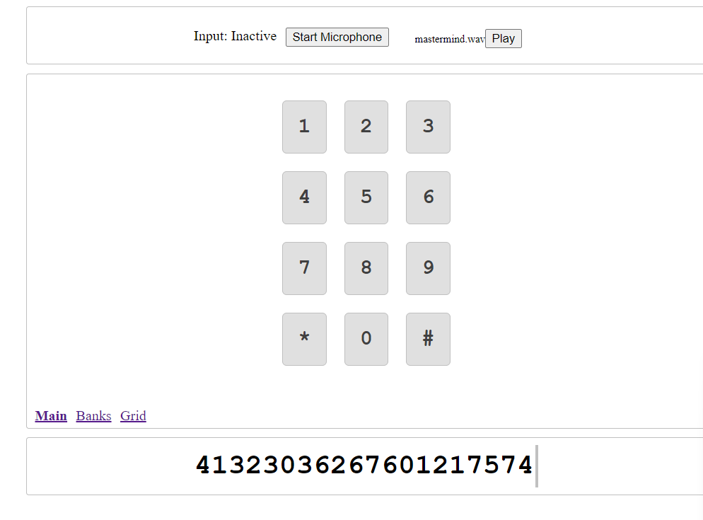
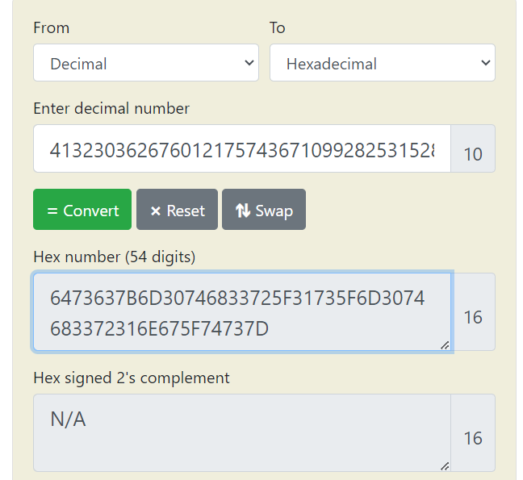
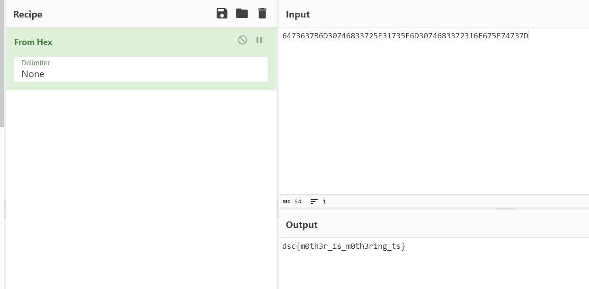

# Mastermind
> You are a hugeee swiftie! You really want to go to The Era's Tour but cannot because you are located in India. You call up Taylor Swift to request her to come to India. She will only come if you can get her a flag. Here's a recording of the call. Can you get her the flag?

## About the Challenge
We got a `wav` file and we need to find the flag there (You can download the file [here](mastermind.wav))

## How to Solve?
If you open the file and listen to the audio. You will notice this is a `DTMF` tones. You can translate the tones using this [website](https://unframework.github.io/dtmf-detect/#/). Just upload the wav file and this website will generate the number for you



Wait until you got all the numbers, and in the end you got this set of numbers

```
41323036267601217574
36710992825315281347
60924906937541136999
02333
```

Merge it, and then convert the decimal into hexadecimal using this [website](https://www.rapidtables.com/convert/number/decimal-to-hex.html)



Now, decode the hex to ASCII using [Cyberchef](https://gchq.github.io/CyberChef/#recipe=From_Hex('None')&input=NjQ3MzYzN0I2RDMwNzQ2ODMzNzI1RjMxNzM1RjZEMzA3NDY4MzM3MjMxNkU2NzVGNzQ3MzdE)



```
dsc{m0th3r_1s_m0th3r1ng_ts}
```