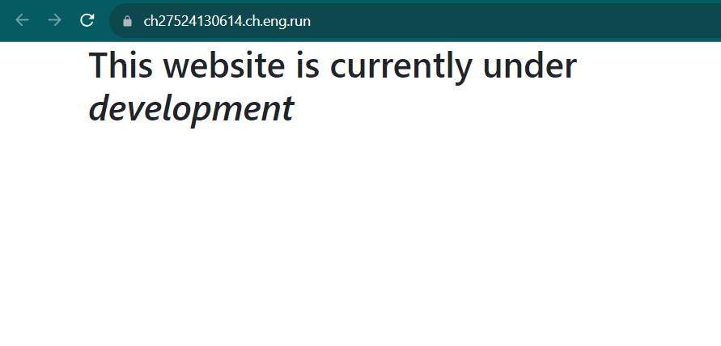
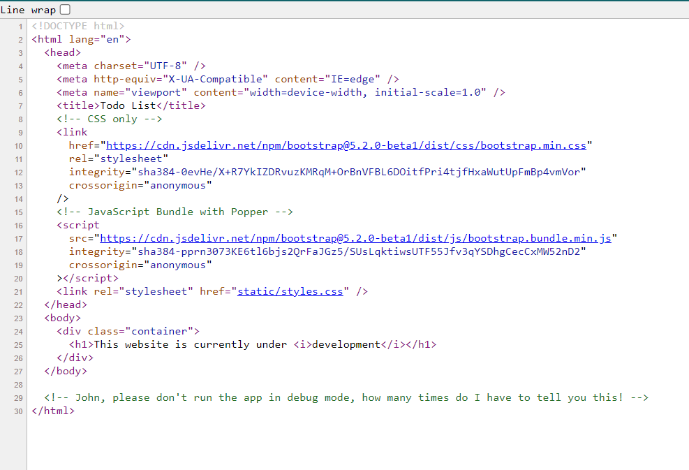
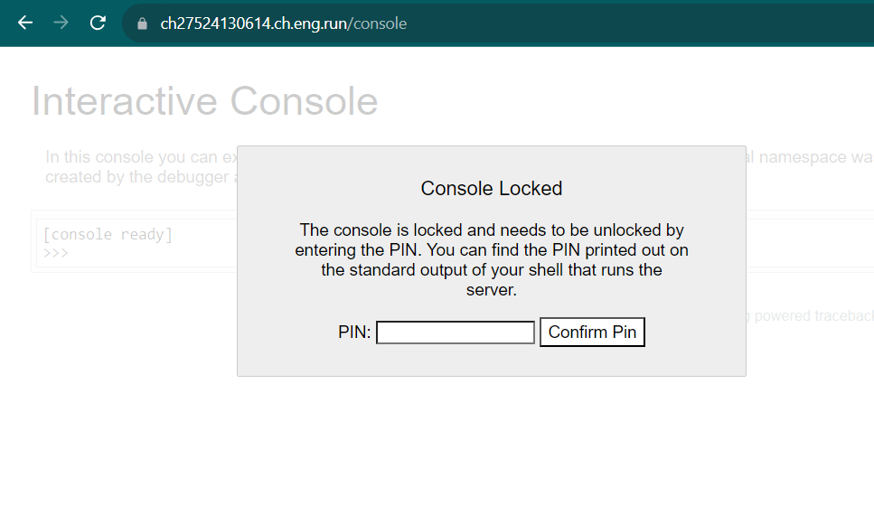
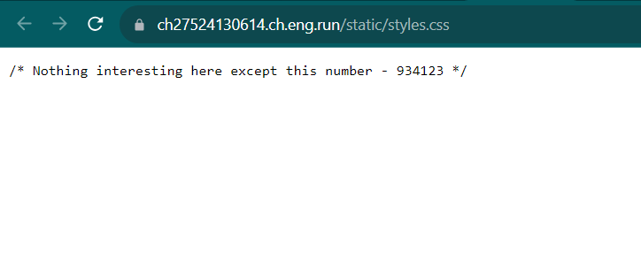
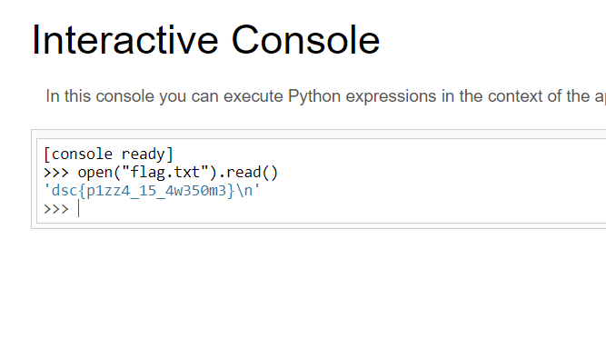

# debugzero
> Someone on the dev team fat fingered their keyboard, and deployed the wrong app to production. Try and find what went wrong. The flag is in a file called "flag.txt"

## About the Challenge
We got a very simple website (And also there is no source code for this chall)



## How to Solve?
First, let's analyze the homepage.



There is a HTML comment, that caught my interest

```html
<!-- John, please don't run the app in debug mode, how many times do I have to tell you this! -->
```

This website was running in debug mode, but we still didn't know about the technology behind it. Then, I decided to try some of the common endpoints, such as `/robots.txt`, `sitemap.xml`, `/console`, `/admin`, etc. And voilà, there was an endpoint called `/console`



But we need to know the PIN code first to use the Werkzeug console. Now, let's get back to the homepage again. You will see there is a CSS file.



934123? Is that a PIN code? As it turned out to be true, that number is the PIN code! Now, we need to open `flag.txt` to obtain the flag. In this case im gonna use `open()`



```
dsc{p1zz4_15_4w350m3}
```