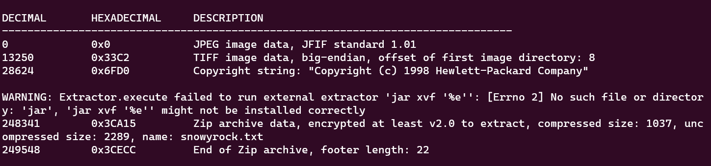
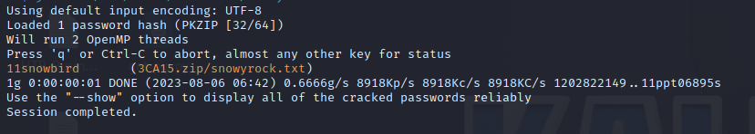
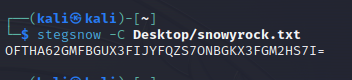
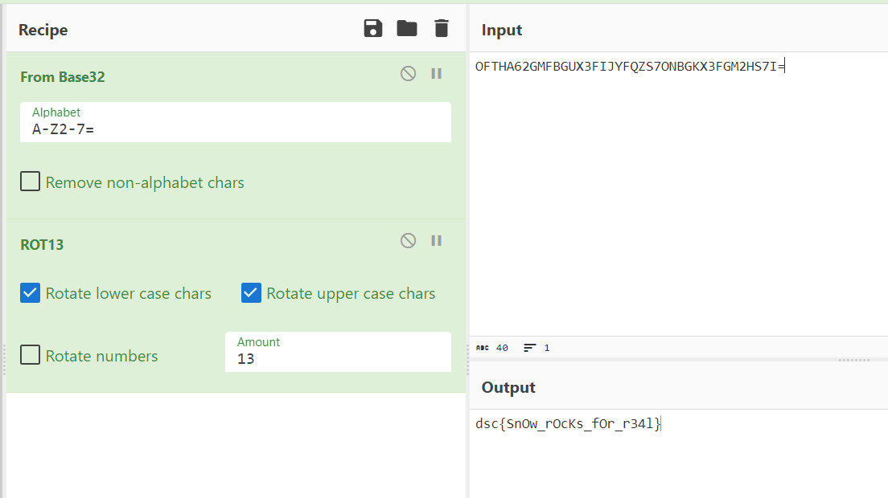

# snowy rock
> am loves puzzles and his dad working in alaska sent a message hidden within for him to uncover
Can you decode it?

## About the Challenge
We got an image and we need to find the flag there (You can download the flag [here](snowy_rock_fi.jpg))

## How to Solve?
First, we need to use `binwalk` to extract the zip file from the image

```bash
binwalk -e snowy_rock_fi.jpg
```



You will see an error but that's okay, that happen because of the zip file was a password-protected file. And then we need to bruteforce the password of the zip file using `john`

```bash
zip2john file.zip > hash.txt
john -w=/usr/share/wordlists/rockyou.txt hash.txt
```



As you can see, the password is `11snowbird`. Extract the file and you will got `snowyrock.txt`. Now, because of the title of the chall and also the `snowyrock.txt` content, I decided to use `stegsnow` to retrieve hidden messages in `snowyrock.txt`

```
stegsnow -C snowyrock.txt
```

This command will run `stegsnow` without using a password



Decode the output using `base64` and also `rot13`



```
dsc{SnOw_rOcKs_fOr_r34l}
```