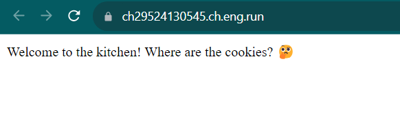
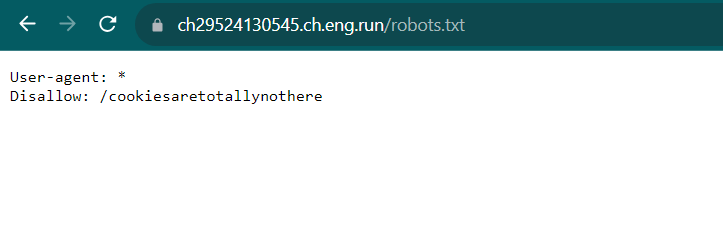
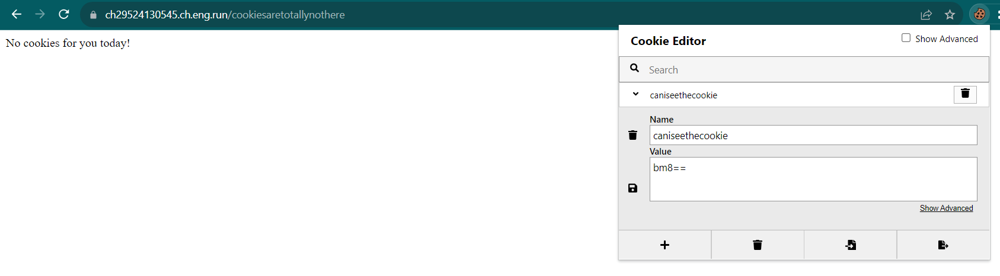
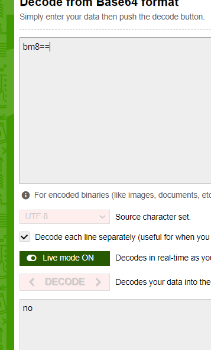
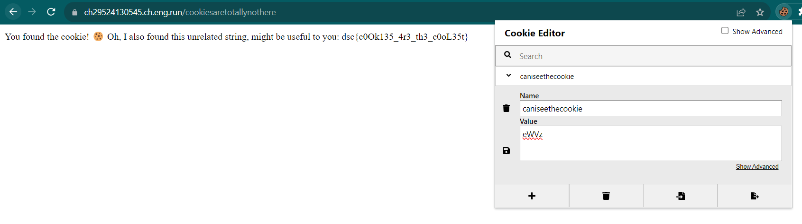

# where-are-the-cookies
> Tom is feeling especially snacky during the CTF, can you find where the cookies are?

> Note: This challenge works best on Chrome

## About the Challenge
We got a very simple website and we need to find the flag in the website



## How to Solve?
First, we need to find some common files such as `robots.txt` / `sitemap.xml`. And in this case, this website have a `robots.txt` file



We discovered another endpoint called `/cookiesaretotallynothere`. When we hit the endpoint, there is a cookie called `caniseethecookie`



Decode the value of the cookie using `base64`



Change from `no` into `yes` and then encode the message again using `base64` encoding



```
dsc{c0Ok135_4r3_th3_c0oL35t}
```