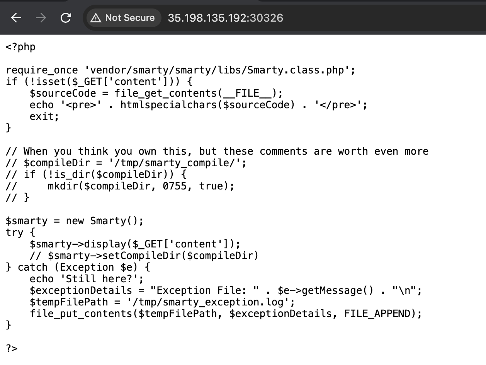
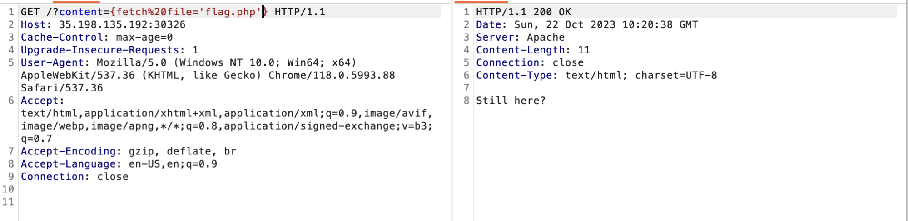
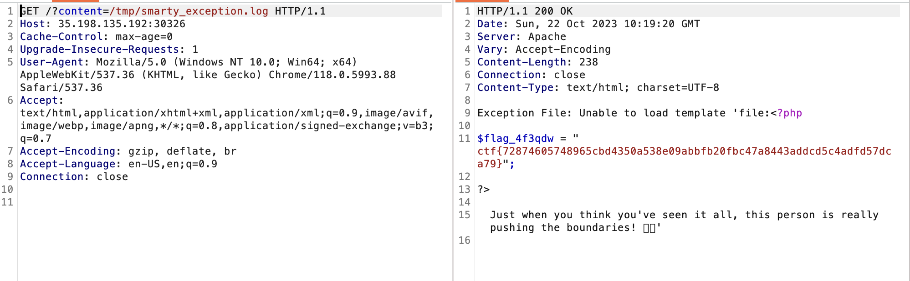

# boze
> How smart and capable is the smarty lib?

## About the Challenge
We were given a website that using smarty template to render our input, here is the preview of the source code



It first checks if a `content` parameter is set in the GET request. If not, it displays the source code of the script. If the `content` parameter is set, it creates a new Smarty object and tries to display the content specified in the `content` parameter. If an exception occurs, it echoes `Still here?` and logs the exception details to a file. The source code is vulnerable to SSTI. We need to input the payload in the `content` parameter and then check the log file to see the output.

## How to Solve?
At first I tried to input every payload which is on `Hacktricks`, but I failed -_- 


And then I tried to read the smarty documentation and I found the `fetch` class method. This function is used to retrieve a resource from a URL. And I inputted in the `content` parameter

```
{fetch file='flag.php'}
```



And then check `/tmp/smarty_exception.log` file to obtain the flag



```
ctf{72874605748965cbd4350a538e09abbfb20fbc47a8443addcd5c4adfd57dca79}
```