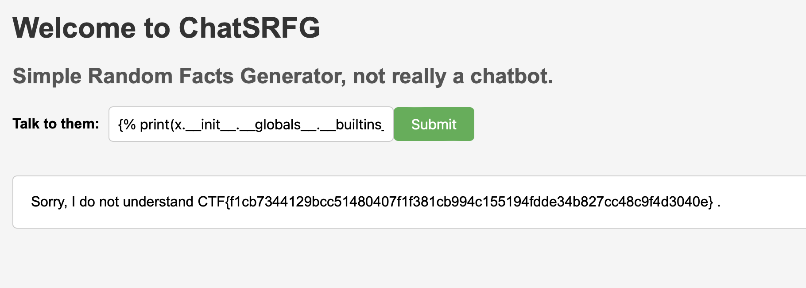

# forty-nine
> We have a random fact generator that might have some problems sanitizing the input. It may not be as simple as 7*7.

## About the Challenge
We were given a website, and there’s only 1 form input in the website


## How to Solve?
And then I tried to input `${{7*7}}` and the output was `Sorry, I do not understand Attack detected!.`. And after analyzing a little bit, sadly we can’t input `{{`

Well, even though we can’t input `{{`, we still can bypass it using `{%`.


And to obtain the flag, we need to execute an OS command by importing the `os` module and then calling the `popen` function and then executing the `cat flag.txt` command.

```

```



```
CTF{f1cb7344129bcc51480407f1f381cb994c155194fdde34b827cc48c9f4d3040e}
```