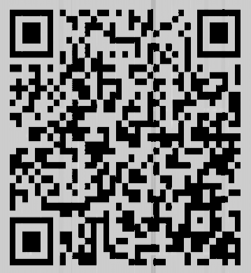
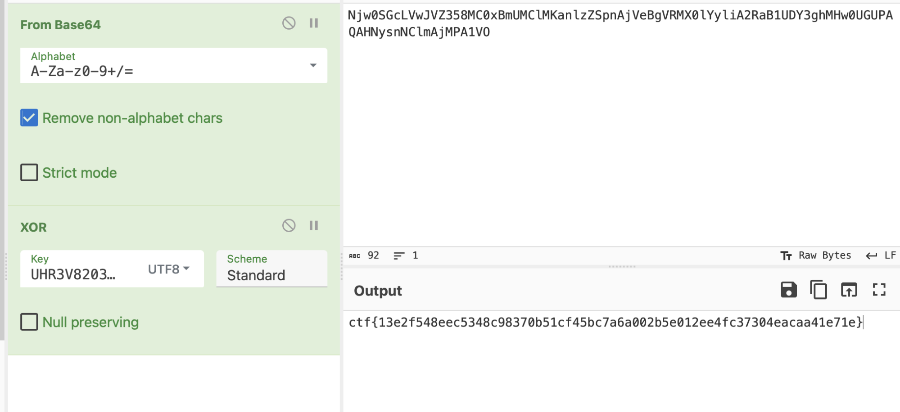

# morse-music
> You might need to cross listen the message within the morse code.

## About the Challenge
We were given a wav file (You can download the file [here](final_sound91976.wav)), and we need to find the flag inside the file

## How to Solve?
If we decode the morse code, we got this message

```
Did you know that this is not about the morse code? It is about the spectogram only that the password is UHR3V8203RJD
```

And if we check the spectogram of the file, there is a QR code



Parse the QR code and we got this string

```
Njw0SGcLVwJVZ358MC0xBmUMClMKanlzZSpnAjVeBgVRMX0lYyliA2RaB1UDY3ghMHw0UGUPAQAHNysnNClmAjMPA1VO
```

Decode it using base64 encoding and then XOR the result with `UHR3V8203RJD` to obtain the flag



```
ctf{13e2f548eec5348c98370b51cf45bc7a6a002b5e012ee4fc37304eacaa41e71e}
```