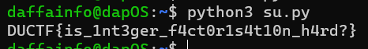

# complementary
> Two halves make a whole.

## About the Challenge
We got 2 files, `complementary.py` and `output.txt`. Here is the content of `complementary.py`

```python
flag = open('./flag.txt', 'rb').read().strip()
m1 = int.from_bytes(flag[:len(flag)//2])
m2 = int.from_bytes(flag[len(flag)//2:])
n = m1 * m2
print(n)
```

The code reads the `flag.txt` file, splits it into two parts, converts each part into an integer, multiplies them together, and prints the result. The exact purpose depends on the content of flag.txt. And here is the content of `output.txt`

```
6954494065942554678316751997792528753841173212407363342283423753536991947310058248515278
```

## How to Solve?
We can use `factordb` to find the value of `m1` and `m2`. Here is the command I used to find the value of `m1` and `m2`

```bash
factordb 6954494065942554678316751997792528753841173212407363342283423753536991947310058248515278
```

And the output was
```
2 3 19 31 83 3331 165219437 550618493 66969810339969829 1168302403781268101731523384107546514884411261
```

Now multiply `2 x 3 x 19 x 31 x 83 x 3331 x 165219437 x 550618493 x 66969810339969829` and the result was `5952648940406176619300725964928725160189798`. And we got 2 big numbers right now

```
m1 = 5952648940406176619300725964928725160189798
m2 = 1168302403781268101731523384107546514884411261
```

I create another program like this

```py
m1 = 5952648940406176619300725964928725160189798
m2 = 1168302403781268101731523384107546514884411261

# Combine m1 and m2 as bytes
flag_bytes = (m1.to_bytes((m1.bit_length() + 7) // 8, 'big') +
              m2.to_bytes((m2.bit_length() + 7) // 8, 'big'))

# Decode the bytes to a string
flag = flag_bytes.decode('utf-8')

print(flag)
```

The code takes two integers, `m1` and `m2`, converts them into a single byte sequence, and then decodes that byte sequence into a UTF-8 string. The print statement displays the resulting a flag.



```
DUCTF{is_1nt3ger_f4ct0r1s4t10n_h4rd?}
```