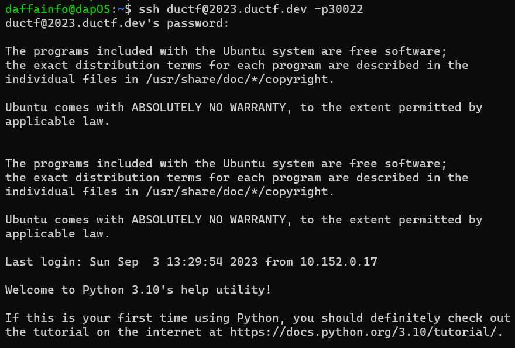
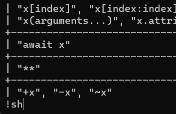
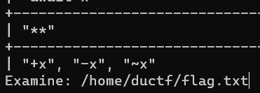
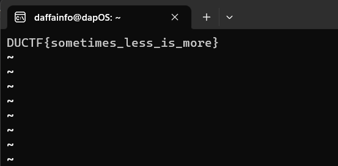

# helpless
> I accidentally set my system shell to the Python help() function! Help!!

> The flag is at /home/ductf/flag.txt.

> The password for the ductf user is ductf.

## About the Challenge
We are given an SSH server, and when we log in, we are immediately in the Python help() function.



## How to Solve?
At first, I tried to spawn a shell using `+` followed by `!sh`, but it didn't work.



And then i checked every command in `help()` function and I found there is `:e` command where we can examine a file





```
DUCTF{sometimes_less_is_more}
```