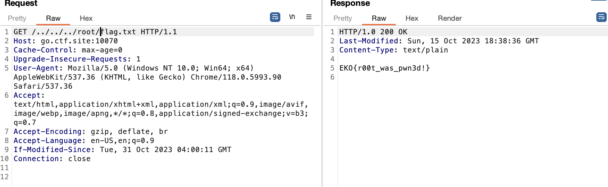

# Future
> You are not allowed to escalate this problem! the root cause as usual is some kind of validation failure, may we have this issue in the near future?

## About the Challenge
We need to pentest the gopher protocol to obtain the flag

## How to Solve?
The gopher protocol is vulnerable to `Directory Traversal` attack, where we can read the flag by accessing `../../../root/.flag.txt`



```
EKO{r00t_was_pwn3d!}
```