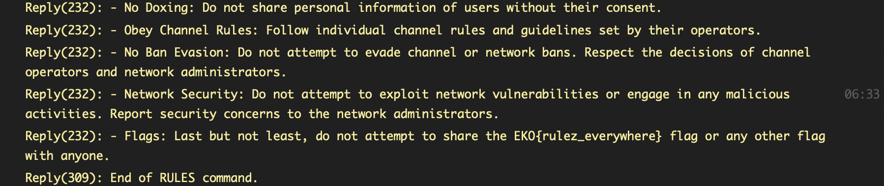

# Rulez
> Rules are meant to be broken.

## About the Challenge
We need to find the "rules" inside the IRC server

## How to Solve?
Just type `/RULES` to check the rules, and then you will find the flag at the end of the rules.



```
EKO{rulez_everywhere}
```