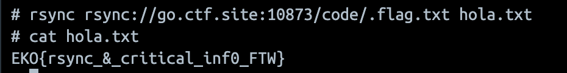

# Sync
> We use the latest technologies for backups.

## About the Challenge
The website using `rsync` protocol to store the flag. We need to download the flag from the server using `rsync` command

## How to Solve?
First, we list the directory first using this command

```bash
rsync rsync://go.ctf.site:10873
```

Result:
```
code
MJ code
```

Now, let's check the `code` directory first using this command

```bash
rsync rsync://go.ctf.site:10873/code
```

Result:
```
drwxrwxr-x        4096 2023/10/22 23:24:59 .
-rw-rw-r--          31 2023/10/22 23:24:58 .flag.txt
```

Woohoo, we found the flag. Now we need to download the file

```bash
rsync rsync://go.ctf.site:10873/code/.flag.txt hola.txt
```



```
EKO{rsync_&_critical_inf0_FTW}
```