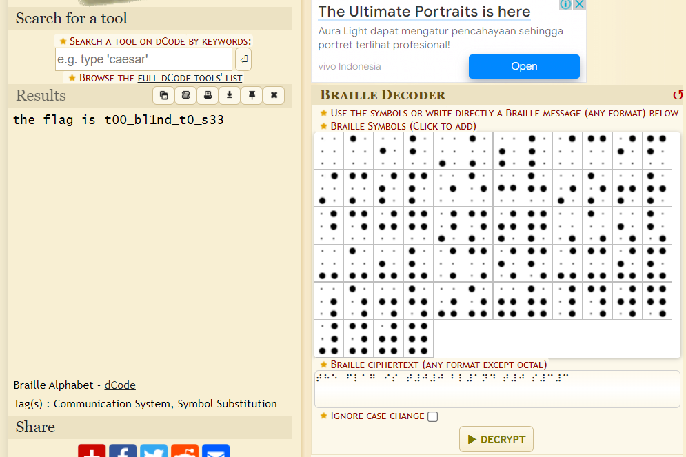

# Blind
> Blinding.

## About the Challenge
We were given a file (You can download the file [here](blind.txt)) and we need to decode it to obtain the flag

## How to Solve?
As you can see in the file, that is a `Braille Alphabet`. So we can use [dcode.fr](https://www.dcode.fr/braille-alphabet) to decode the msg



```
grepCTF{t00_bl1nd_t0_s33}
```