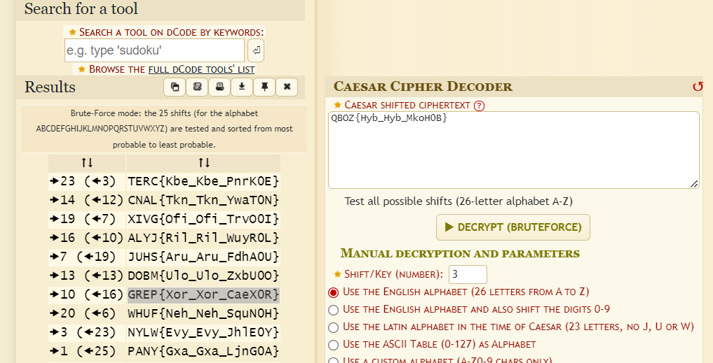

# CaeX0R
> I pressed shift key 10 times and lost the flag. Can you find my flag.

## About the Challenge
We were given a file to encrypt the flag (You can download the file [here](enc.py))

Here is the content of `enc.py` file
```python
#enc.py
from random import *
flag="REDACTED"
a=randint(1,1000)
c=[]
for f in flag:
   c.append(str(ord(f)^a))
print(c)
print(a)

#c=['162', '177', '188', '169', '136', '187', '138', '145', '172', '187', '138', '145', '172', '190', '152', '156', '187', '195', '177', '142']
#a=REDACTED
```

This Python code defines a script that performs a simple encryption on a flag using XOR cipher. The encryption key is a random integer between 1 and 1000 generated using the `randint()` function from the random module.

## How to Solve?
As you can see in the `enc.py` file, the seed is not really random because that function only generate a random integer between 0 and 1000. So to solve I have created the script to bruteforce the key from 0 to 1000

```python
c=['162', '177', '188', '169', '136', '187', '138', '145', '172', '187', '138', '145', '172', '190', '152', '156', '187', '195', '177', '142']

for a in range(1, 1001):
    flag = ""
    for char_code in c:
        char_code = int(char_code)
        char = chr(char_code ^ a)
        flag += char
    
    print(flag)
```

And im using `grep` too to find the flag. But in this case we can't find the flag directly, but I will search for the string containing the characters `{` and `_`

```shell
python3 solve_caex0r.py | grep "{" -a | grep "_"
```


As you can see the last result was interesting, So i put that string into caesar cipher decoder (You can use [dcode.fr](https://www.dcode.fr/caesar-cipher) to do this)



```
GREP{Xor_Xor_CaeX0R}
```