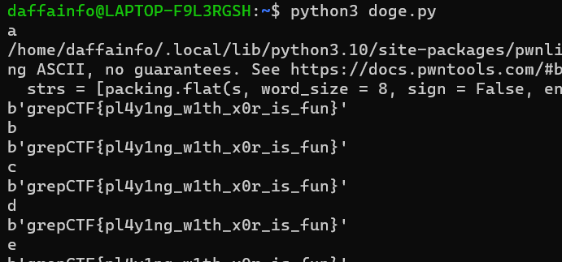

# DOGE DOGE DOGE
> Doge

## About the Challenge
We were given a file to encrypt the flag (You can download the file [here](doge.py))

Here is the content of `doge.py` file
```python
from Crypto.Util.number import *
from pwn import xor
flag = b'REDACTED'
key = b'REDACTED'
enc = b''
for i in range(len(flag)):
    enc += xor(key[i], flag[i])
print(enc)
# enc = b'#="5\x07\x1b\x01>4#s<u! \x1a3~3-\x1b7w7\x1b&4\x1a":)8'
```

This Python code uses the PyCrypto library to perform bitwise XOR operations on the individual bytes of a given plaintext flag using a fixed XOR key. The resulting ciphertext `enc` is printed to the console in bytes format.

## How to Solve?
So in this case, I have created a script to perform a brute-force attack on a single-byte XOR encryption scheme. It uses the PyCrypto library to perform bitwise XOR operations on the individual bytes of a given ciphertext enc using a variable-length XOR key

```python
from Crypto.Util.number import *
from pwn import xor
import itertools

alphabet = 'abcdefghijklmnopqrstuvwxyzABCDEFGHIJKLMNOPQRSTUVWXYZ1234567890'
enc = b'#="5\x07\x1b\x01>4#s<u! \x1a3~3-\x1b7w7\x1b&4\x1a":)8'

for combination in itertools.product(alphabet, repeat=1):
    test = ''.join(combination)
    print(test)
    key = test+'aaaaaaaaaaaaaaaaaaaaaaaaaaaaaaa'

    flag = b''
    for i in range(len(enc)):
        flag += xor(key[i], enc[i])

    print(flag)
```

So, for this script, I recover the keys manually by checking the output one by one. And the end, the key was `DOGEDOGEDOGEDOGEDOGEDOGEDOGEDOGE`



```
grepCTF{pl4y1ng_w1th_x0r_is_fun}
```