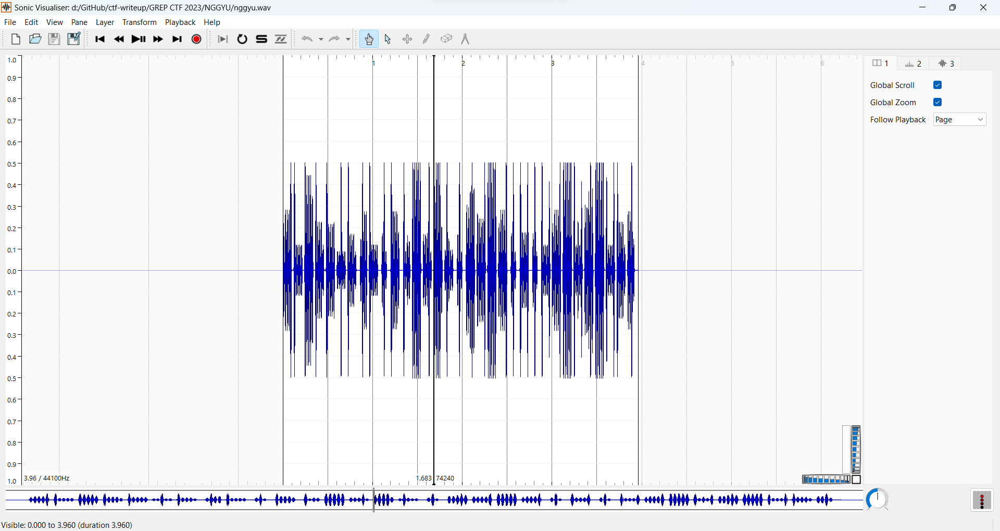
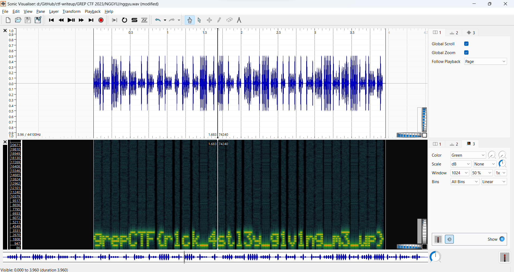

# NGGYU
> .

## About the Challenge
We were given a file (You can download the file [here](nggyu.wav)) and we need to find the flag using that sound

## How to Solve?
First, open the `Sonic Visualizer` and then import the file



Press `G` button to open Spectogram panel and you will obtain the flag



```
grepCTF{r1ck_4stl3y_g1v1ng_m3_up}
```