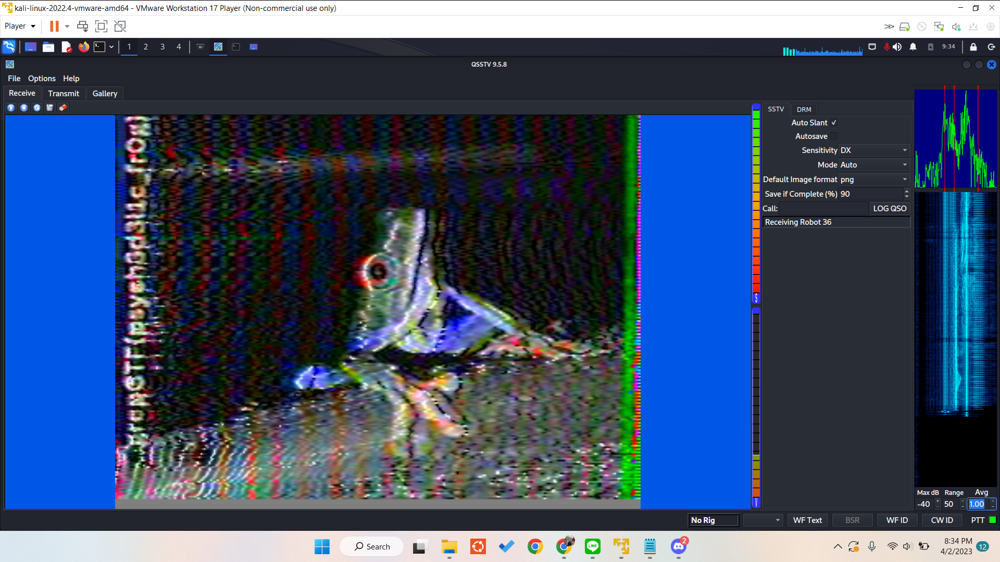

# R36
> 36 different robots were used to generate this sound.

## About the Challenge
We were given a file (You can download the file [here](r36.wav)) and we need to find the flag using that sound

## How to Solve?
To solve this, Im using this [reference](https://ctftime.org/writeup/22354) because the chall is similar. This challenge was about SSTV or Slow Scan Television where you can send static image using only sound. So im using `qsstv` and then run the audio.



```
grepCTF{psych3d3l1c_fr0g}
```