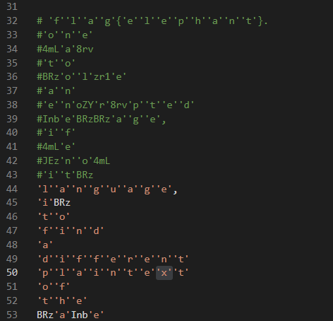

# trios
> what number is a trio?

## About the Challenge
We were given a script file called `trios.py`. Here is the content of the file

```python
import random

chars = [chr(i) for i in range(48, 58)] + [chr(i) for i in range(65, 91)] + [chr(i) for i in range(97, 123)]
alphabet = []

while len(alphabet) < 26:
    run = True
    while run:
        string = ""
        for _ in range(3): string += chars[random.randint(0, len(chars) - 1)]
        if string in alphabet: pass
        else: run = False
    alphabet.append(string)

keyboard_chars = [chr(i) for i in range(97, 123)]

dic = {char: term for char, term in zip(keyboard_chars, alphabet)}

msg = "REDACTED"
encoded = ""

for word in msg:
    for letter in word:
        if letter.lower() in dic.keys():
            encoded += dic[letter.lower()]
        else: encoded += letter

print(encoded)
```

And we got another file called `data.txt` that contains encoded msg

```
8wnAPR2svyje{RbcAPRRbczwtwDE2svphjIqr}. uZbphjRbc 4mL2sv8rv IqruZb BRzuZbAPRzr1Rbc 2svphj RbcphjoZYQHJ8rvzwtIqrRbcHu0 InbRbcBRzBRz2svyjeRbc, tKO8wn 4mLRbc JEzphjuZb4mL tKOIqrBRz APR2svphjyje4zD2svyjeRbc, tKOBRz IqruZb 8wntKOphjHu0 2sv Hu0tKO8wn8wnRbcQHJRbcphjIqr zwtAPR2svtKOphjIqrRbcGawIqr uZb8wn IqrwDERbc BRz2svInbRbc APR2svphjyje4zD2svyjeRbc APRuZbphjyje RbcphjuZb4zDyjewDE IqruZb 8wntKOAPRAPR uZbphjRbc BRzwDERbcRbcIqr uZbQHJ BRzuZb, 2svphjHu0 IqrwDERbcphj 4mLRbc oZYuZb4zDphjIqr IqrwDERbc uZboZYoZY4zDQHJQHJRbcphjoZYRbcBRz uZb8wn Rbc2svoZYwDE APRRbcIqrIqrRbcQHJ. IIqrBRz tKOAPRAPRRbcyje2svAPR IqruZb uZb4mLphj k7j4zDBRzIqr uZbphjRbc yje4zDtKOphjRbc2sv zwttKOyje tKOphj S4mLtKOIqr2stRbcQHJAPR2svphjHu0.
```

So the code generates a random substitution cipher by mapping each lowercase letter to a unique three-character string. It then encodes a given message using this substitution cipher, replacing each lowercase letter with its corresponding three-character string. For example:

```
a = k8w
b = ohh
...
```

## How to Solve?
To solve this, im using manual approach by replacing the three-character string manually and I got the flag



```
flag{elephant}
```