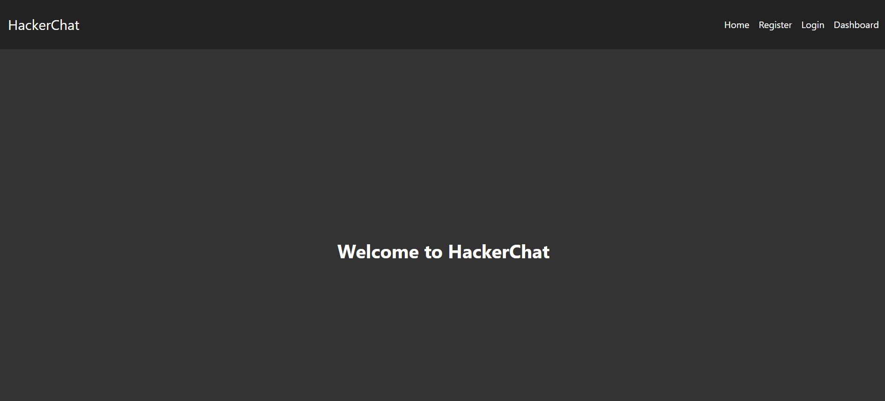
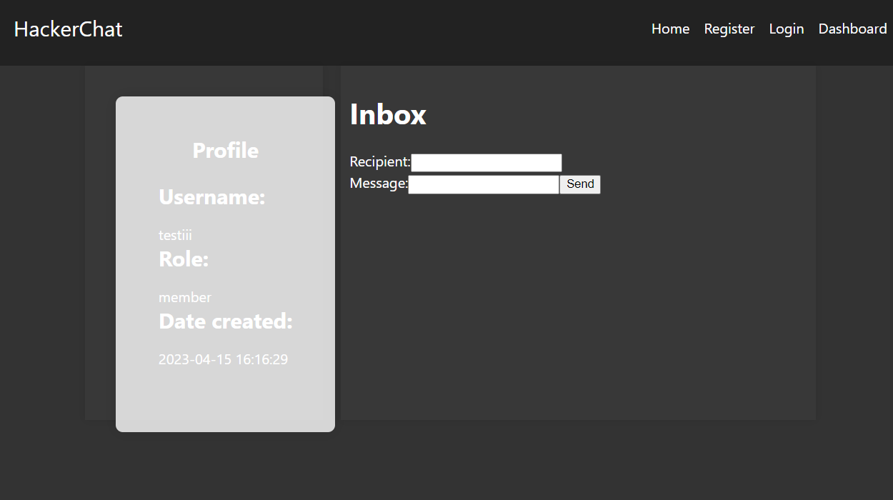
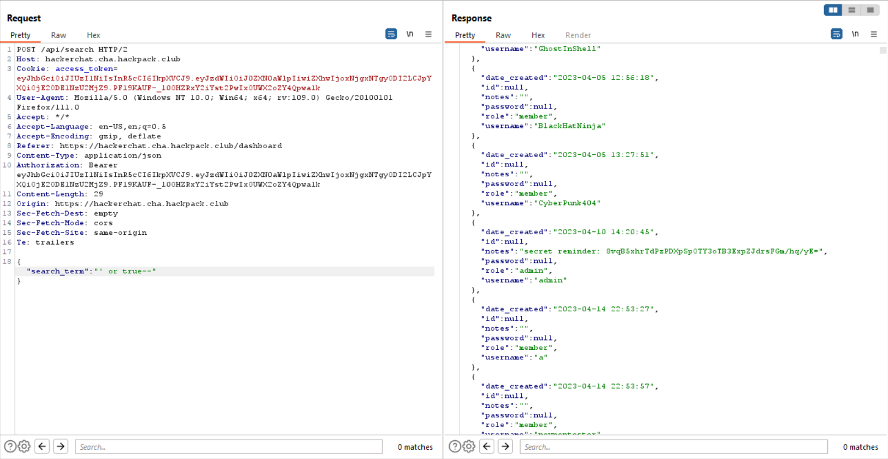
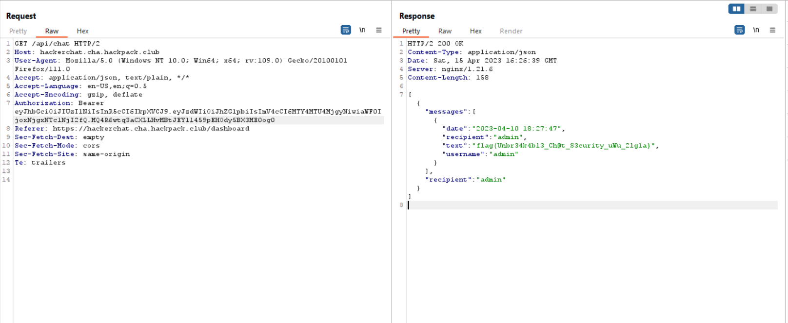

# HackerChat
> HackerChat is the hottest new chat app for hackers. Can you recover the secret message sent to the HackerChat admin?

## About the Challenge
We are given a website that has multiple functionality such as send msg to another user, login, register, etc.



## How to Solve?
Register first and then login to the website and you will see this page



You will notice there are 2 API endpoints when accessing dashboard page
* /api/chat
* /api/search

There is a SQL injection vulnerability on `/api/search` endpoint on `search_term` parameter. Input `' or true--` in that parameter to print all the user information



As we can see, we found admin username and there is an interesting notes there

```
secret reminder: 8vqB5xhrTdPzPDXpSpOTY3oTB3ExpZJdrsFGm/hq/yE=
```

The `secret reminder` refers to the JWT secret, which is required in order to modify the value of the `Authorization` token from your username (For example testiiii) to `admin`


Now, go to `/api/chat` history and don't forget to change the `Authorization` token and voilà you will obtain the flag



```
flag{Unbr34k4bl3_Ch@t_S3curity_uWu_2lgla}
```